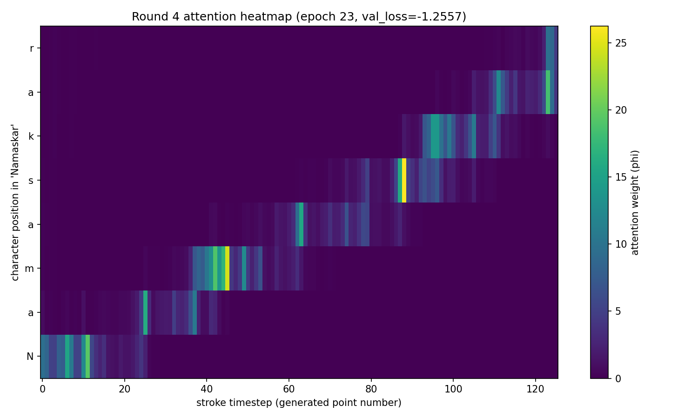
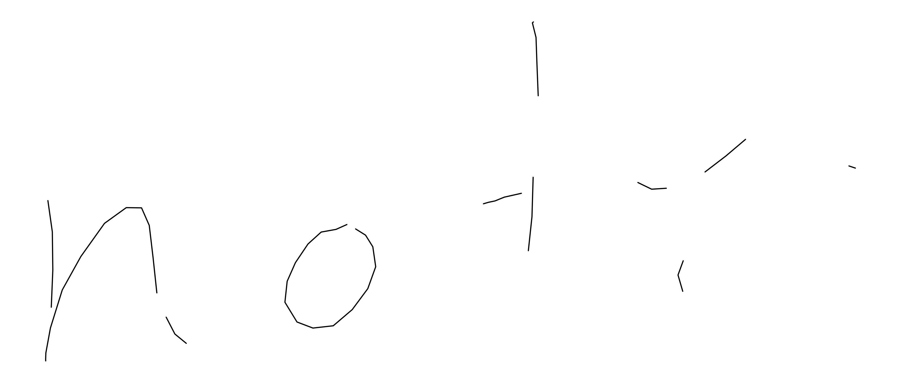
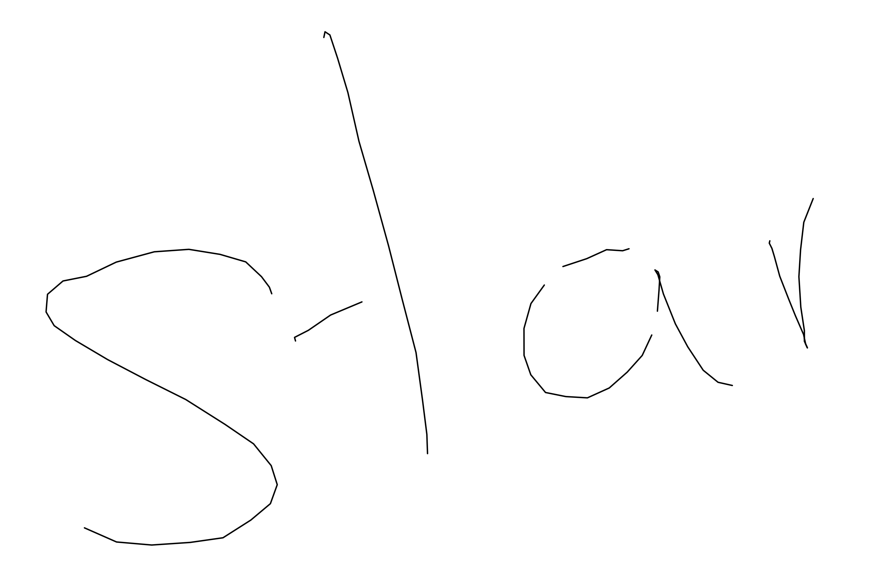
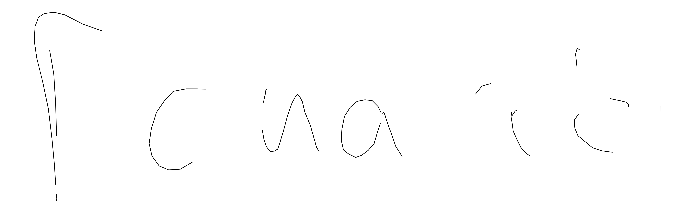

# Handwriting Synthesis AI - Poori Documentation
### Zero se seekho: yeh AI kaise text ko human jaisi handwriting mein badalta hai

Yeh document is tarah likha gaya hai ki agar tumhe coding aur AI ka bilkul
bhi basic pata nahi hai to bhi tum ise padh kar samajh sakte ho ki poora
system kaise kaam karta hai aur khud bhi waisa hi bana sakte ho. Har section
mein pehle concept simple bhasha mein samjhaya gaya hai, uske baad asli code
ka chhota sa hissa dikhaya gaya hai comments ke saath.

---

## Section 0 - Yeh Project Hai Kya

Hum ek AI bana rahe hain jise agar koi text diya jaaye jaise "Namaskar" to
wo us word ko ek insaan jaisi cursive handwriting mein khud se likh de.
Yeh koi image generate karne wala AI nahi hai jaisa DALL-E hota hai. Yeh
ek **sequence generation** wala AI hai, matlab wo pen ki nok ko ek ek
chhote step mein move karna seekhta hai, bilkul waise jaise koi insaan
haath se likhta hai.

Training ke liye humne IAM On-Line Handwriting Database use kiya hai, jo
147 alag alag insaano ne likha hua real pen movement data hai. Is dataset
mein sirf photo nahi hai, balki har pen stroke ka x aur y coordinate time
ke saath record kiya gaya hai.

---

## Section 1 - Bilkul Basic Concepts (agar AI ka A B C bhi nahi pata)

**Neural Network kya hota hai**
Ek neural network ek badi si calculator hai jisme bahut saare numbers
(weights kehlate hain) hote hain. Hum isme input numbers dete hain, wo
kuch multiplication aur addition karke output numbers deta hai. Shuru mein
yeh weights random hote hain isliye output bhi bekaar hota hai. Training
ka matlab hai in weights ko dheere dheere sahi karna taaki output sahi
aane lage.

**Training kaise hoti hai (chaar step ka cycle)**
1. Forward Pass - model ko input do, wo apna current best guess deta hai
2. Loss Calculate - dekho model ka guess sahi answer se kitna door tha,
   is difference ko ek number mein convert karte hain jise loss kehte hain
3. Backward Pass (Backpropagation) - yeh calculate karta hai ki har weight
   ko kis direction mein aur kitna badalne se loss kam hoga
4. Update - sabhi weights ko thoda thoda us direction mein move kar dete
   hain, is process ko gradient descent kehte hain

Yeh chaaron step lakhon baar repeat hote hain, tab jaake model kuch
seekhta hai.

**Tensor kya hota hai**
Bas ek fancy naam hai numbers ke array ka. Ek single number ek tensor hai,
numbers ki ek list bhi tensor hai, numbers ka grid bhi tensor hai. PyTorch
library isi tensor par saara kaam karti hai.

**Epoch, Batch aur Step**
Poora dataset ek saath GPU mein nahi daala ja sakta, memory kam pad jaati
hai. Isliye dataset ko chhote chhote groups mein baanta jaata hai jise
batch kehte hain. Ek batch process karna ek step kehlata hai. Jab poora
dataset ek baar cover ho jaata hai (saare batches process ho jaate hain)
to use ek epoch kehte hain.

**Loss Function kya hota hai**
Yeh ek formula hai jo batata hai model ka answer kitna galat hai. Loss
jitna kam hoga model utna accha perform kar raha hai, is number ko hi
minimize karne ki koshish training karti hai.

---

## Section 2 - Handwriting Ko Numbers Mein Kaise Badalte Hain

Insaan ki handwriting ko AI ke samajhne layak banane ke liye har pen stroke
ko teen numbers mein todte hain, har chhote se timestep ke liye:

```
dx  = pen ka x direction mein kitna hila (pichle point se)
dy  = pen ka y direction mein kitna hila (pichle point se)
pen = 1 agar isi point ke baad pen kaagaz se upar uthi, warna 0
```

Absolute pixel position (jaise x=340, y=120) use nahi karte, sirf
**relative movement** (dx, dy) use karte hain. Isse fayda yeh hota hai ki
chahe word page ke kisi bhi corner mein likha jaaye, ya chhota likha jaaye
ya bada, AI ko sirf "movement ka pattern" seekhna padta hai, position ka
nahi. Yehi wajah hai ki ek trained model kisi bhi jagah, kisi bhi size mein
likh sakta hai.

Text (jaise "Namaskar") ko bhi numbers mein badalna padta hai. Har unique
character (a, b, c, space, etc) ko ek number id diya jaata hai, is poore
mapping ko **vocabulary** kehte hain.

---

## Section 3 - Data Preparation (`preprocess_iam_ondb.py`)

Yeh script raw IAM-OnDB ki XML files padhta hai jisme har writer ke pen
ke actual coordinates hote hain, aur unhe clean karke ek `.npz` file mein
save karta hai jo training ke liye ready hoti hai.

**Normalization ka code kaise kaam karta hai (simplified):**

```python
# har consecutive point ke beech ka farak nikalna
dx = x_coords[1:] - x_coords[:-1]
dy = y_coords[1:] - y_coords[:-1]

# poore dataset ka mean aur standard deviation nikalna
mean_dx, mean_dy = dx.mean(), dy.mean()
std_dx, std_dy = dx.std(), dy.std()

# ab sab kuch usi scale par la dena (roughly -3 se +3 ke beech)
normalized_dx = (dx - mean_dx) / std_dx
normalized_dy = (dy - mean_dy) / std_dy
```

Yeh normalization isliye zaroori hai kyunki agar kuch numbers 0.001 range
mein ho aur kuch 500 range mein, to neural network training instable ho
jaati hai. Sabko ek jaisi scale par laane se training smooth chalti hai.

**Asli run ka result** (`preprocessing_report.json` se):

| Cheez | Number |
|---|---|
| Total XML files mile | 12195 |
| Structurally valid files | 12187 |
| Final sequences jo dataset mein gaye | 12126 |
| Total data points (saare writers milakar) | 7,616,725 |
| Unique writers | 147 |
| Reject hue (coordinate mein achanak bada jump) | 61 |
| Reject hue (label index range se bahar) | 8 |
| Mean dx, dy | 8.21, 0.12 |
| Std dx, dy | 42.27, 37.07 |

Matlab lagbhag 99.4 percent files clean nikli aur dataset mein chali gayin,
sirf 69 files ko reject karna pada kyunki unme data corrupt tha.

---

## Section 4 - Model Architecture (asli "dimaag" kaise bana)

Model ke andar paanch major blocks hain. Har ek ko ek insaan ke kaam se
compare kar ke samajhte hain.

```
strokes_in (pen ki history)
      |
      v
StrokeEmbedding  ---- ek chhoti si Linear layer jo 3 numbers (dx,dy,pen)
      |                ko ek badi 256-number vector mein badal deti hai
      v                taaki network ke paas kaam karne ke liye zyada
CausalConformerBackbone   "room" ho
      |          (yeh haath hai -- pichle movements ka momentum yaad rakhta hai)
      |
      |         text (jo likhna hai) --> TextEncoder
      |                                       |
      |                                       v
      +----------> MonotonicGaussianAttention (yeh aankh hai -- text ko
      |                                       |          left se right padhti hai)
      |                                       v
      |                                  context vector
      v                                       |
      +-------------------- concat -----------+
                    |
                    v
              Fusion Layer (haath aur aankh dono signals ko balance karke milata hai)
                    |
                    v
                MDN Head (final decision -- agla pen movement kya hoga)
```

### 4.1 StrokeEmbedding - Haath ki Feeling

```python
self.stroke_embedding = nn.Linear(stroke_dim, d_model)  # 3 -> 256
```
Sirf ek Linear layer hai jo teen simple numbers ko 256 numbers ki richer
representation mein badal deti hai, taaki aage ka network unse zyada
pattern nikaal sake.

### 4.2 Causal Conformer Backbone - Haath Ka Momentum

Conformer ek architecture hai jo pehle speech recognition ke liye banaya
gaya tha, yeh self-attention (dooor ke points ko bhi dekh sakta hai) aur
convolution (paas ke points ka local pattern pakadta hai) dono ko milata
hai. Isse model ko pen ke movement ka "flow" aur "momentum" samajhne mein
madad milti hai, jaise ek letter ke curve ka natural flow.

**"Causal" ka matlab kya hai** - model sirf ab tak ke pen movements dekh
sakta hai, future ke points nahi. Yeh isliye zaroori hai kyunki asli
generation ke time model ko future pata hi nahi hota, wo ek ek point
banata jaata hai. Agar training mein model ko future dikha diya jaaye to
wo generation ke time kaam nahi karega kyunki tab future exist hi nahi
karta.

### 4.3 Text Encoder - Text Ko Samajhna

Character ids (jaise "Namaskar" ke liye [N, a, m, a, s, k, a, r] ke
numbers) ko ek embedding layer, phir convolution, phir bidirectional LSTM
se guzarte hain taaki har character ka context uske aas paas ke characters
ke saath mil kar ek meaningful vector bana sake.

### 4.4 Monotonic Gaussian Attention - AI Ki Aankh (sabse clever hissa)

Yeh sabse interesting part hai. Isko Graves 2013 paper se liya gaya hai,
jisme model text ko ek fixed window ke through padhta hai jo hamesha
aage hi badhti hai, kabhi peeche nahi jaati aur kabhi kisi letter ko
skip nahi karti. Yeh "monotonic" property isi liye zaroori hai kyunki
insaan bhi likhte waqt word ko left se right hi padhta hai.

Original paper mein yeh ek LSTM ke through step by step (sequentially)
calculate hota tha, ek time pe ek hi point. Hamara Conformer parallel mein
poore sequence ko ek saath process karta hai, isliye humein ek naya
tareeka nikalna pada jise yahan **vectorized trick** kehte hain.

```python
# har timestep par ek chhota sa "kitna aage badhna hai" predict karte hain
kappa_increment = torch.exp(kappa_hat.clamp(max=6.0))   # hamesha positive
                                                          # rakhte hain

# ab poori history ka running total (cumulative sum) nikal lete hain
kappa = torch.cumsum(kappa_increment, dim=1)
```

`torch.cumsum` ek built-in function hai jo apne aap running total banata
hai - matlab position 5 ki value = position 1 se 5 tak ke saare increments
ka jod. Yeh bilkul wahi kaam karta hai jo original LSTM sequentially karta
tha (ek ek karke jodna), bas yahan ek hi line mein poore sequence ke liye
parallel mein ho jaata hai, koi Python loop nahi chalani padti. Isse
training bahut fast ho jaati hai.

`kappa_increment` ko `exp()` se guzarna zaroori hai taaki wo hamesha
positive rahe - agar increment kabhi negative ho jaaye to attention
peeche chali jaayegi aur "monotonic" property toot jaayegi.

Isi block mein ek aur parameter hai jise `beta` kehte hain, jo yeh
control karta hai ki attention ka focus kitna sharp (ek letter par tight)
ya kitna wide (kai letters ek saath dhundhla) hai. Yeh parameter aage
Phase 9 mein ek bada bug banega, jaha model isay jaan bujh kar chhota
kar deta hai - us poori kahani ke liye Section 7 ka Phase 9 dekho.

### 4.5 Fusion Layer - Wo Jagah Jaha Sabse Bada Bug Tha

Yahan haath (Conformer ka output) aur aankh (attention ka context) dono
ko milaya jaata hai. Round 1 ki training mein yahi wo jagah thi jaha
"Joint LayerNorm Bug" mila tha - ek hi normalization layer dono signals ko
saath mein normalize kar rahi thi, jisse haath ka signal aankh ke signal
se 6 guna zyada loud reh jaata tha.

**Fix wala code (asli model.py se):**

```python
# GALAT tareeka (round 1 se pehle):
# combined = torch.cat([h, context], dim=-1)
# combined = self.joint_norm(combined)   # ek hi norm dono ke liye

# SAHI tareeka (fix ke baad):
self.h_norm = nn.LayerNorm(d_model)        # haath ko alag normalize karo
self.context_norm = nn.LayerNorm(text_dim)  # aankh ko alag normalize karo

h_normed = self.h_norm(h)
context_normed = self.context_norm(context)
fused = self.fusion(torch.cat([h_normed, context_normed], dim=-1))
```

Har signal ko pehle apni khud ki normalization milti hai (apna mean zero,
apna spread ek jaisa), tabhi unhe milaya jaata hai. Isse dono signals
barabar importance ke saath network tak pahunchte hain, aur network khud
seekh leta hai ki kis time par kisko zyada weight dena hai - kisi accident
ki wajah se nahi.

### 4.6 MDN Head - Final Decision (Mixture Density Network)

Yahan ek zaroori concept hai: agla pen movement predict karte waqt AI ek
hi fixed answer nahi deta. Kyunki handwriting mein hamesha thoda variation
hota hai (ek "a" har baar thoda alag likha jaata hai), model **multiple
possible answers ka ek probability cloud** deta hai, jise Mixture Density
Network (MDN) kehte hain.

Har timestep par model 20 chhote "guesses" (mixtures) deta hai, har ek ke
paas:
- `pi` - is guess par kitna bharosa karna hai
- `mu_x, mu_y` - is guess ke hisab se pen kaha jaayega
- `sigma_x, sigma_y` - kitna uncertain hai yeh guess
- `rho` - x aur y movement aapas mein kitne juday hue hain
- `pen_logit` - pen uthana hai ya nahi, iski probability

```python
# sigma hamesha positive honi chahiye, isliye exp() use karte hain
sigma_x = torch.exp(sigma_x_hat.clamp(-7.0, 7.0))

# rho hamesha -1 se +1 ke beech honi chahiye, isliye tanh() use karte hain
rho = torch.tanh(rho_hat).clamp(-1 + 1e-6, 1 - 1e-6)
```

`clamp` yahan safety ke liye lagaya gaya hai - agar raw number bahut bada
ho jaaye to `exp()` explode karke infinity de sakta hai, jo aage jaake
poori training ko NaN (invalid number) bana sakta hai. Yeh chhoti si line
poori training run ko crash hone se bachati hai.

---

## Section 5 - Loss Function: Model Ki Galti Kaise Naapte Hain (`loss.py`)

Ab hume yeh naapna hai ki model ke MDN guesses asli target se kitne door
hain. Seedha seedha formula lagane mein ek badi dikkat hai jise samajhna
zaroori hai.

**Problem - Underflow:**
Gaussian probability density ka formula `exp(-badi_value)` involve karta
hai. Agar model ki prediction bahut galat hai (training ke shuru mein
aam baat hai), to yeh `badi_value` itni bada ho sakti hai ki `exp()` uska
result seedha `0.0` de deta hai (computer ki precision khatam ho jaati
hai). Agar sab 20 mixtures ka result `0.0` ho jaaye to unka total bhi
`0.0` hoga, aur loss formula mein `-log(0.0)` lagana padta hai jo
`infinity` deta hai. Ek hi aisi galti poori batch ki training kharab kar
sakti hai.

**Fix - Log-Space mein kaam karna:**

```python
# GALAT (seedha linear space mein):
# density = sum(pi_m * exp(-Z_m / 2))    # exp() yaha underflow kar sakta hai
# loss = -log(density)

# SAHI (log-space mein, kabhi exp() call nahi hota mixture density ke liye):
log_N = bivariate_gaussian_log_density(...)      # seedha log() formula, exp() nahi
log_pi_N = log_pi + log_N                         # log(a*b) = log(a) + log(b)
log_mixture_density = torch.logsumexp(log_pi_N, dim=-1)   # safe combine
stroke_nll = -log_mixture_density
```

`torch.logsumexp` ek special built-in trick hai jo `log(sum(exp(...)))`
ko bina kabhi actual `exp()` overflow kiye calculate kar leta hai (yeh
sabse bade number ko pehle subtract karta hai, phir baad mein wapas jod
deta hai). Isse mixture ka sahi answer milta hai bina underflow ke risk ke.

**Pen-lift ke liye Class-Weighted Loss:**
Asli handwriting mein pen uthana rare event hai (measured rate sirf
3.97 percent time). Agar simple loss use karein to model "hamesha pen
neeche hi rakho" bol kar bhi kam loss paa sakta hai - yeh ek lazy shortcut
hai jo model khud dhoond leta hai.

```python
true_rate = 0.0397   # actual data se measure kiya gaya
pos_weight = (1.0 - true_rate) / true_rate    # ~= 24.18

pen_nll = F.binary_cross_entropy_with_logits(
    pen_logit, pen_target, pos_weight=pos_weight
)
```

`pos_weight` ka matlab hai: agar model ek asli pen-lift miss karta hai, to
uski saza normal galti se 24 guna zyada hogi. Isse model ko pen-lift
predict karna seriously lena padta hai, sirf usko ignore nahi kar sakta.

---

## Section 6 - Training Loop Kaise Chalta Hai

**Teacher Forcing** - training ke time model ko har step par pichla
ASLI (ground truth) point diya jaata hai, uska khud ka guess nahi. Isse
training fast aur stable hoti hai, kyunki agar model ek galti kare to wo
agle step tak carry nahi hoti.

```python
strokes_in = strokes[:-1]      # model ko yeh dikhaya jaata hai (input)
strokes_target = strokes[1:]   # model ko yeh predict karna hai (answer)
```

**AMP (Automatic Mixed Precision)** - GPU par speed badhane ke liye
zyadatar calculation float16 (chhoti precision) mein hoti hai, jo fast
hoti hai lekin kam accurate. Kuch jagah jaha numbers bahut chhote ya bahut
bade ho sakte hain (jaise MDN ka log-space calculation, attention ka
cumsum), wahan explicitly float32 (poori precision) force ki jaati hai
taaki NaN na aaye:

```python
with torch.autocast(device_type=device.type, enabled=False):
    # yahan andar sab kuch float32 mein hoga, speed thodi kam
    # lekin stability zaroori hai
    ...
```

**Gradient Clipping** - kabhi kabhi gradient (weight update ki direction
aur magnitude) achanak bahut bada ho jaata hai, jisse training unstable ho
jaati hai. Isliye har update se pehle gradient ki maximum size limit kar
dete hain:

```python
torch.nn.utils.clip_grad_norm_(model.parameters(), max_norm=1.0)
```

**Warm Start** - poori training dobara shuru karne ke bajaye, ek pehle se
trained checkpoint se weights uthate hain aur wahin se aage badhte hain.
Yeh module bahut carefully likha gaya hai kyunki agar galti se kisi trained
layer ko fresh weights se overwrite kar diya jaaye to woh silently poori
training ka kaafi kaam waste kar deta hai:

```python
# har purani weight ko naye model mein daalne se pehle check karte hain
if new_key not in merged:
    raise AssertionError("yeh key kaha se aayi, architecture mismatch hai")
if merged[new_key].shape != tensor.shape:
    raise AssertionError("shape match nahi hui, silently load mat karo")
merged[new_key] = tensor   # tabhi safe hai jab dono checks pass ho jaayein
```

Yeh code jaan bujh kar "loudly fail" karta hai (error raise karta hai)
agar kuch match na ho, kyunki ek silent galti mahino baad pakdi jaati hai
jab tak wo bahut mehnga bug ban chuki hoti hai.

---

## Section 7 - Poori Journey: Kaise Ek Ek Karke Bugs Pakde Aur Fix Kiye

*Har training round ke end mein ek chhota "Round Verdict" box hai jo
us round ka result ek nazar mein deta hai - kya done hua, kya nahi,
aur agla remaining hypothesis kya hai. Poora detail padhne ka time na
ho to sirf yeh boxes scan kar lena kaafi hai.*

### Phase 1 - Data Preparation
IAM-OnDB ke raw XML files ko padha, saaf kiya, normalize kiya, aur ek
training-ready `.npz` file mein save kiya. 147 writers ka 7.6 million
data points wala dataset taiyar hua (Section 3 dekho).

### Phase 2 - Base Training (Pehle 47 Epochs)
Conformer model banaya aur 47 epochs tak train kiya. Result mixed tha,
attention (text ko padhna) 100 percent perfect seekh liya, lekin actual
handwriting output stretched aur kharab tha.

### Phase 3 - Deep Diagnosis: Joint LayerNorm Bug
Root cause pakda gaya (Section 4.5 dekho) - haath ka signal aankh ke
signal se 6 guna zyada loud tha isliye model text ignore karke bas
andhe ki tarah cursive loops banata tha.

### Phase 4 - Brain Surgery: Weight Remapping
`h_norm` aur `context_norm` ko alag alag split karke fix kiya. Scratch se
training ke bajaye 143 purane trained tensors ko naye model mein safely
transfer kiya (warm start), jisse mahino ki compute power bachi.

### Phase 5 - Expert Fine-Tuning
`train_expert.py` (round 1) 39 epochs chala aur validation loss ko
record-breaking -1.5886 tak le gaya.

### Phase 6 - Reality Check: Exposure Bias Trap
Validation loss record tha, lekin real generation test mein "Namaskar"
977 steps mein sirf 1 baar pen uthata tha - poora kachra output. Deep
diagnosis se pata chala model **exposure bias** ka shikaar tha:
training mein hamesha perfect (teacher-forced) history milti thi, lekin
generation ke time model ko apni khud ki chhoti galtiyon par aage chalna
padta tha. Ek chhoti galti step by step compound hoti gayi aur model itna
"panic" kar gaya ki pen uthana hi bhool gaya (pen-lift probability 8x
gir gayi). Validation loss isliye blind tha kyunki wo sirf perfect data
par calculate hota hai, self-generated data par nahi.

Iska fix teen parts mein tha (poora code detail Section 5 aur 6 mein):
input noise injection, class-weighted pen loss, aur periodic visual
checks.

> **Round 1 Verdict**
> - Validation loss: excellent (record `-1.5886`)
> - Pen physics: not done (real generation mein 977 steps mein sirf 1 pen-lift)
> - Character identity: not testable (output itna garbage tha ki spelling judge karna possible nahi tha)
>
> Main remaining hypothesis: exposure bias - teacher forcing par zyada
> bharosa, generation ke apne errors se recovery training mein kabhi
> nahi seekhi gayi thi.

### Phase 7 - Warm-Start Fix aur Epoch 0 Ki Jeet
Naya `train_expert.py` (round 2, teeno fixes ke saath) launch kiya gaya.
Warm start karte waqt ek chhupa hua bug mila - purana migration table yeh
maan kar chal raha tha ki source checkpoint bahut purana architecture wala
hai, jabki wo pehle se hi fixed (post h_norm/context_norm) architecture
istemal kar raha tha. Isliye ek already-trained layer chupke se delete
hoke fresh reinitialize ho rahi thi, bina kisi warning ke.

```python
# fix: pehle check karo ki source checkpoint naya hai ya purana
is_post_fix_source = any(k.startswith("h_norm.") for k in old_state_dict)
migration = {} if is_post_fix_source else FUSION_KEY_MIGRATION
```

Fix hone ke baad model ne apne 147 ke 147 tensors bina kisi loss ke
reuse kiye. Result shandar tha - sirf Epoch 0 ke baad hi "map border" bug
lagbhag khatam ho gaya. Pehle 977 steps mein 1 pen-lift ho rahi thi, ab
141 steps mein 11 baar sahi tarike se pen uthi. Achanak heavy penalty
(24x) aur naya noise ek saath aane ki wajah se pehli generated image
thodi rough thi, lekin system ki basic "physics" (pen kab uthani hai)
poori tarah theek ho gayi thi.

### Phase 8 - Muscle Memory aur Convergence
Model ko 40 epochs tak lagataar train hone diya gaya taaki wo naye rules
(pen kab uthana hai, input noise se kaise nipatna hai) ki poori aadat daal
le. Har 5 epoch mein ek periodic visual check chala ("Namaskar" khud se
likhwa kar image save karna) taaki dheere dheere yeh dekha ja sake ki
tooti hui handwriting kaise smooth cursive mein badalti hai. Yeh poore
40 epochs successfully complete hue, aur validation loss ek naye
record-low -0.88 tak pahunch gaya. Lekin jaisa aage Phase 9 mein pata
chalega, sirf validation loss accha hona kaafi nahi tha.

---

### Phase 9 - "Blurry Vision" Bug Aur Dual AI Audit
Round 2 ki poori 40-epoch training safaltapoorvak khatam hui aur
validation loss record-low -0.88 par set ho gaya. Pen-lift wala bug bhi
poori tarah solve ho chuka tha, ab model 16 se 20 tak sahi pen-lifts
generate kar raha tha. Sab kuch numbers ki nazar se perfect lag raha tha.

Lekin jab model se asli mein "Namaskar" likhwaya gaya, toh output kuch
alag hi nikla. Pen ka movement bilkul smooth aur cursive tha, ekdum
insaan jaisa flow tha, lekin spelling ghalat aa rahi thi jaise "Tanack"
ya "Tanoacco". Matlab model ne pen chalana toh perfectly seekh liya tha,
lekin wo letters ko aapas mein mix kar raha tha, jaise usko sahi se pata
hi na ho ki kis waqt kaunsa letter likhna hai.

**Root Cause Dhoondhna: Dual AI Audit**
Is confusion ko samajhne ke liye ek gehra code review kiya gaya, jise
"Dual AI Audit" naam diya gaya, matlab do alag AI systems se independently
poora training code aur checkpoint audit karwaya gaya. Isme ek bahut hi
interesting cheez samne aayi, jise ek "Deep Learning Exploit" kaha ja
sakta hai - matlab model ne khud training process ki ek kamzori dhoondh
kar uska galat fayda utha liya tha.

**Asli Wajah - Model Ki Aankhein Dhundhli Ho Gayi Thin**
Phase 7 mein exposure bias hatane ke liye humne training input mein thoda
noise (`noise_std = 0.1`) daala tha, taaki model chhoti galtiyon se
recover karna seekhe (Section 6 dekho). Lekin model ne is noise se bachne
ka ek "sasta" (lazy) raasta dhoondh liya, jo gradient descent ke through
apne aap ho gaya, kisi ne jaan bujh kar nahi sikhaya.

Section 4.4 mein humne dekha tha ki attention mechanism mein ek `beta`
parameter hota hai jo yeh control karta hai ki AI ki "aankh" ka focus
kitna sharp (narrow) ya kitna dhundhla (wide) hai. Model ne apna `beta`
jaan bujh kar bahut chhota kar diya:

| | Median Beta |
|---|---|
| Healthy model (jaisa hona chahiye) | 2.56 |
| Naya model (bug wala) | 0.35 (kuch jagah to sirf 0.0001) |

Jab beta chhota hota hai, matlab attention window bahut wide aur dhundhli
ho jaati hai, toh usi window ke andar aane wala noise "average out" ho
jaata hai aur uska teacher-forced validation loss par bahut kam asar
padta hai. Yeh ek sasta shortcut tha jisse validation loss achha dikhta
rehta, lekin haqeeqat mein model kisi ek letter par focus karne ke
bajaye ek saath 2 se 3 letters ko dhundhla dekh raha tha. Generation ke
time yehi wajah thi ki letters aapas mein mix ho gaye aur "Namaskar" ki
jagah "Tanack" jaisa kuch nikla. Yeh ek achha udaharan hai is baat ka ki
sirf loss number accha hona kaafi nahi hota, kabhi kabhi model training
metric ko "game" kar leta hai apni real understanding sudhare bina.

**The Fixes (Round 3 Ki Taiyari)**

Fix number ek - Beta Guardrail (AI ko Chashma Pehnana). Attention module
mein ek hard lower limit laga di gayi taaki beta kabhi bhi ek certain
seema se zyada dhundhla na ho sake:

```python
# monotonic_attention.py mein
min_beta_hat = -2.3   # yeh roughly beta ~ 0.1 ke barabar hai

beta_hat = beta_hat.clamp(min=min_beta_hat, max=kappa_clamp)
beta = torch.exp(beta_hat)
```

Ab model kitna bhi lazy hone ki koshish kare, uski attention ek limit se
zyada wide nahi ho sakti, matlab usay har letter par thoda proper focus
karna hi padega.

Fix number do - Ek Chhupa Hua Config Bug. Audit ke dauran pata chala ki
naya `min_beta_hat` parameter checkpoint ki `model_config` file mein save
hi nahi ho raha tha. Agar isay fix nahi karte, toh yeh bug abhi kuch nazar
nahi aata kyunki training chal rahi hoti hai training script ke apne
default value ke saath, lekin baad mein jab koi is checkpoint ko sirf
generation ke liye load karta (bina training script ke), toh model
config mein yeh parameter missing milta aur system chup chaap crash ho
jaata, bina kisi clear reason ke.

```python
# fix: model banane se pehle config dict mein explicitly check aur add karo
model_config = dict(old_ckpt["model_config"])
if "min_beta_hat" not in model_config:
    model_config["min_beta_hat"] = args.min_beta_hat
model = HandwritingSynthesisModel(**model_config).to(device)
```

Yeh chhoti si cheez seekhne layak hai - jab bhi model mein koi naya
tunable parameter add karo, use hamesha checkpoint ke config mein bhi
explicitly save karo, warna future mein koi bhi is checkpoint ko dobara
load karega toh usay pata hi nahi chalega ki wo parameter exist karta
hai.

Fix number teen - Noise Kam Karna Aur Seed Fix Karna. Model ko itna
zyada stress na dena padhe is wajah se `noise_std` ko 0.1 se ghata kar
0.03 kar diya gaya, taaki model ko noise se recover karna toh aaye
lekin utni zyada majboori mein wo apni attention hi dhundhli na kar de.

Sath hi ek chhoti par zaroori cheez fix ki gayi - periodic visual check
ke time har baar `seed = epoch` use ho raha tha, matlab har epoch par
random seed badal jaata tha. Isse dikkat yeh thi ki agar generation
achha ya bura dikhe, hume pata hi nahi chalta ki yeh model ki asli
progress hai ya sirf us particular seed ki random luck. Ab ek fixed
seed (`args.seed`) use kiya jaata hai har visual check ke liye, taaki
epoch se epoch tak jo bhi improvement dikhe wo genuinely model ki
learning ki wajah se ho, kisi random chance ki wajah se nahi.

In teeno solid fixes ke saath ab "Round 3" ki expert training shuru kar
di gayi hai, jisme `attention_width` (beta kitna sharp hai) aur `n_lifts`
(pen kitni baar sahi uth rahi hai) dono ko lagataar monitor kiya ja raha
hai, taaki is baar cursive flow aur spelling dono ek saath perfect aa
sakein.

> **Round 2 Verdict**
> - Validation loss: excellent (record `-0.88`)
> - Pen physics: done (16-20 sahi pen-lifts, exposure bias fix ho gaya)
> - Attention stability: not done (beta median `2.56` se gir kar `0.35`
>   tak aa gaya, kabhi kabhi `0.0001`)
> - Character identity: not done ("Namaskar" ki jagah "Tanack"/"Tanoacco")
>
> Main remaining hypothesis: model ne noise se bachne ke liye attention
> ko jaan-bujh kar dhundhla (wide) kar diya, jisse letters aapas mein
> mix ho gaye.

---

### Phase 10 - Round 3 Poori Kahani (Epoch 0 se Epoch 39 tak, Training Complete)

Round 3 humare AI model ka **chautha (4th) training attempt** tha. Is
baar Phase 9 ke teeno fixes (beta floor `min_beta_hat = -2.3`, kam noise
`noise_std = 0.03`, fixed evaluation seed) ek saath active the, aur
training warm-start hui thi Round 2 ke best checkpoint (epoch 37, val
loss `-0.8912`) se. Warm start bilkul clean raha, model ne apne saare
147 tensors bina kisi galti ke reuse kiye, koi purani layer drop ya
fresh reinitialize nahi hui.

Poori 40-epoch training ab complete ho chuki hai. Neeche poori journey
ka ek table hai, jisme har periodic check (har 5 epoch) ka data hai:

| Epoch | Val Loss | Attention Width (beta) | Pen-Lifts | Namaskar Kaisa Nikla |
|---|---|---|---|---|
| 0 | -0.9684 | 0.849 | 31 | Bikhri hui, disconnected marks - koi letter shape nahi |
| 5 | -1.1301 | 0.876 | 13 | Continuous lekin garbled, jaise "toiiisic" |
| 10 | -1.1497 | 0.876 | 15 | "lanacle" jaisa - letters ban rahe hain, galat |
| 15 | -1.1722 | 0.855 | 19 | "lancicle" jaisa - kuch letters fragment hone lage |
| 20 | -1.1874 | 0.726 | 19 | Bahut fragmented, "Tonic ci" jaisa tuta hua |
| 25 | -1.1860 | 0.891 | 18 | "Tonacclr" - strokes wapas continuous, spelling stable |
| 30 | -1.2076 | 0.817 | 16 | "Tonacclr" - bilkul same jaisa Epoch 25 |
| 35 | -1.2136 | 0.811 | 17 | "Tonacclr" - bilkul same jaisa Epoch 25 aur 30 |
| 39 (final) | -1.2196 | - | - | (koi naya visual check is epoch par nahi hua) |

**Pehla accha sign: val loss turant purane best se aage nikal gaya.**
Round 2 ka best (`-0.8912`) Round 3 ke pehle hi epoch mein cross ho
gaya (`-0.9684`), aur training khatam hote hote yeh `-1.2196` tak
pahunch gaya, jo Round 2 se lagbhag 37 percent behtar hai.

**Shuru ke epochs mein "shock phase" dikha.** Epoch 0 ki image mein
sirf bikhri hui, chhoti chhoti disconnected marks thi, koi letter shape
nahi ban rahi thi, kyunki model 290 points mein 31 baar pen utha raha
tha (expected sirf 11-12 ke aas paas). Yeh isliye hua kyunki ek saath
do badi cheezein badal di gayi thi (beta floor aur kam noise), aur
model ki purani (Round 2 wali) strategy achanak kaam karna band kar
di. Epoch 5 tak yeh sudhar gaya, pen-lifts 13 par aa gaye aur strokes
continuous ban gaye.

**Beech ke epochs mein "physics" theek hua, phir letter mapping mein
ek pattern set ho gaya.** Epoch 10-15 tak model ne roughly letter jaisi
shapes banani shuru ki ("lanacle", "lancicle"), lekin Epoch 20 par
achanak wapas heavy fragmentation aa gayi (attention_width bhi is
epoch par sabse neeche, `0.726`, chala gaya). Epoch 25 tak yeh fir se
stabilize hua, aur tabhi se ek specific galat spelling pattern -
lagbhag "Tonacclr" jaisa kuch - set ho gaya jo Epoch 25, 30, aur 35
teeno mein practically identical raha (maine teeno images khud dekhi
hain, teeno mein wahi T-o-n-a shuru hoke fragmented c-curves wali
pattern hai).

**Sabse important, honest observation: spelling ~20 epochs se frozen
thi jabki loss lagataar (chhota sa) improve hota raha.** Epoch 25 se
Epoch 39 tak val loss `-1.1860` se `-1.2196` tak gaya (chhota sa
sudhar), lekin generated spelling in poore 15 epochs mein ek baar bhi
nahi badli. Yeh ek genuinely strong signal hai ki training ke aakhri
hisse mein jo bhi improvement ho raha tha, wo stroke ki smoothness ya
kisi aur cheez se aa raha tha, letter-identity sahi karne se nahi.

**Beta khud kabhi wapas pathological level tak nahi gaya.** Round 2
mein regressed model ka beta median `0.35` tak gir gaya tha (aur min
`0.0001`). Round 3 mein poori training ke dauran beta `0.7` se `0.9`
ke beech hi raha, kabhi bhi us purane khatarnak level ke kareeb nahi
gaya. Matlab beta floor ne apna kaam kiya, "blurry vision" wapas nahi
aayi.

**Jo abhi bhi verify nahi hua: "iski wajah beta clamp ka dead gradient
hai" wala specific claim.** Yeh ek reasonable hypothesis hai (agar koi
parameter ek hard limit par baar baar clamp hota hai, to us jagah par
gradient zero ho sakta hai, jisse wo parameter aage seekh nahi paata),
lekin kisi bhi log mein actual gradient values ya kitne parameters
clamp boundary par hit ho rahe hain, yeh kabhi measure nahi kiya gaya.
Jo confirm hua hai wo sirf yeh hai ki **kuch** stuck hai, yeh nahi ki
**kaha** stuck hai. Ek doosri equally possible wajah yeh bhi ho sakti
hai ki fusion layer ya MDN head ke weights apne aap ek local minimum
mein phas gaye hon, jiska beta se koi seedha lena dena na ho.

**Ek chhota extra bug bhi poori training mein log hota raha.** Training
script har epoch par ek PyTorch warning deta raha ki `lr_scheduler.step()`
ko `optimizer.step()` se pehle call kiya ja raha hai. Isse training
crash nahi hoti, lekin learning rate schedule ka pehla value skip ho
jaata hai. Chhoti si cheez hai jo aage clean ki ja sakti hai.

**Final honest summary:** Round 3 ek genuine success hai is maayne mein
ki "physics" (pen ka movement, kab uthana hai, stroke ki smoothness)
poori tarah theek ho gaya aur beta kabhi pathological level tak nahi
gaya. Lekin spelling ka problem poori 40 epochs mein solve nahi hua -
yeh Epoch 20 ke aas paas ek fixed galat pattern par set ho gaya aur
wahi tak raha. Iska matlab yeh nahi ki Round 3 fail hui, isne bahut
kuch fix kiya aur ek bahut specific, narrow problem expose kar diya:
letter-identity ka learning kahi na kahi stuck hai. Iski exact wajah
(beta clamp, ya kuch aur) abhi bhi confirmed nahi hai.

**Round 4 ka pehla plan (softplus fix) baad mein badal diya gaya** - jaisa
Phase 11 mein aage detail hai, ek doosri diagnosis session ne beta-clamp
wali theory ko hi reject kar diya, isliye softplus wala fix ab implement
nahi kiya gaya. Neeche poori diagnosis process hai.

> **Round 3 Verdict**
> - Pen physics: done
> - Pen-lift behaviour: done
> - Attention stability (beta kabhi pathological level tak nahi gaya): done
> - Character identity (sahi letter likhna): not done
>
> Main remaining hypothesis (Phase 10 ke time tak): text-to-stroke
> alignment / fusion layer ki learning kahi stuck hai (exact jagah abhi
> unconfirmed - Phase 11 mein isay actually test kiya gaya).

---

### Phase 11 - Round 3 Ke Baad Ki Diagnosis (Round 4 Se Pehle)

Round 3 khatam hone ke baad, "spelling kyun stuck hai" ka jawab dhoondhne
ke liye tumne do theories ko **actually test** kiya, sirf reasoning se
nahi, balki asli checkpoint aur asli data par diagnostic scripts khud
chalake. Yeh kaam lamba tha, beech mein ek AI tool ka token limit khatam
ho gaya, to uska poora reasoning transcript ek doosre AI tool ko diya
gaya taaki analysis wahi se aage continue ho sake. Baad mein yeh dono
diagnostic scripts ek baar phir chalaye gaye taaki result reproduce ho.
Aakhir mein tumne asli `best_model.pth` checkpoint upload karke sabse
zaroori claims (Theory A, Theory B ke saare checks, aur Adam-state wala
calculation) ek baar aur dobara run karwa ke cross-verify karwaya, koi
transcript par bharosa kiye bina. Neeche jo likha hai wo in sabhi runs
ka combined, cross-verified result hai.

**Theory A: kya beta clamp se koi "dead gradient zone" bana?**
Isay test karne ke liye ek diagnostic script (`diagnose_theory_a_beta_deadzone.py`)
banaya gaya jo asli checkpoint par ek forward pass chalata hai, `beta_hat`
ke clamp se PEHLE wale raw value ka gradient nikalta hai (ek PyTorch hook
ke through), aur usay alpha aur kappa ke gradient se compare karta hai
usi layer, usi batch, usi backward pass se.

```python
# forward hook lagana taaki param_proj ka clamp-se-pehle wala output
# capture ho sake, bina model ka forward pass badle
def capture_hook(module, inputs, output):
    output.retain_grad()
    captured["raw"] = output
    return None

handle = attn.param_proj.register_forward_hook(capture_hook)
```

Result: sirf 23 percent positions clamp floor par hit ho rahe the (poori
tarah dominant nahi), aur zyada important, **beta ka actual gradient
(`6.78e-2`) alpha ke gradient (`3.81e-2`) se bada nikla** - jo starvation
ke bilkul ulta hai. Agar beta genuinely "dead" hota, to uska gradient
sabse chhota hona chahiye tha, sabse bada nahi. **Theory A reject ho
gayi**, seedhe measurement se, hypothesis se nahi.

**Theory B: kya problem kahi aur (local minimum) hai?**
Isay teen alag checks se test kiya gaya:

1. **Per-module gradient health** - text encoder, backbone, attention,
   fusion, aur MDN head, sabka gradient norm alag alag measure kiya
   gaya usi backward pass se.
2. **MDN mixture confidence** - kya model apne 20 mixture options mein
   se ek par bahut zyada confidently commit kar raha hai (jo "confidently
   wrong" hone ka sanket ho sakta hai)? Result: mean top-1 probability
   `0.626` (agar model uncertain hota to yeh `0.05` ke aas paas hota),
   entropy sirf 34 percent of max. Matlab model bahut confident hai apne
   ek choice par, jo galat hai.
3. **Text-encoder embedding confusion** - kya "N" aur "T", ya "m" aur
   "n" jaisi jo letters aapas mein confuse ho rahi hain, unke learned
   embeddings normal se zyada kareeb hain? Result: koi statistically
   significant difference nahi mila (z-score sirf 0.07 - bilkul random
   jaisa). Matlab character embeddings khud problem nahi hain.

**Sabse bada finding: MDN head ka gradient baaki sab modules se kaafi
zyada tha.** Text encoder, backbone, attention, fusion - sabka gradient
chhota (`0.15` se `0.65` ke beech), jabki MDN head ka gradient bahut
zyada tha. Yeh ek genuinely dhyan dene layak imbalance hai, aur teen
alag independent runs mein consistently reproduce hua hai.

**Ek zaroori caveat is finding par:** MDN head ka exact gradient number
har alag run mein alag aaya (`198.0`, `45.076`, `92.50`, `44.44`). Yeh
koi calculation error nahi hai - har run mein `n_sequences` (batch size)
alag tha, isliye har baar genuinely alag real data ka batch process ho
raha tha. **Qualitative finding (MDN head ka gradient baaki se
order-of-magnitude zyada hai) paanch independent runs mein solid raha
hai**, lekin exact "kitna zyada" wala specific multiplier batch-dependent
hai, isliye koi ek fixed number quote nahi karna chahiye.

**Global gradient clipping ka asar bhi check kiya gaya**, aur pata chala
ki `clip_grad_norm(max_norm=1.0)` MDN head ke bade gradient ki wajah se
sabhi parameters ko lagbhag `0.011x` tak scale kar deta hai (upstream
layers ka gradient bahut chhota reh jaata hai). Yeh sahi observation
hai, lekin isse yeh nateeja nikalna ki "clipping hi asli problem hai"
jaldi tha.

**Kyunki: is claim ko ab actually test bhi kiya ja chuka hai, aur yeh
sahi nikla.** Pehle yeh sirf ek code comment mein assert kiya gaya tha
ki "Adam apne aap gradient imbalance ko equalize kar deta hai" - is
document ke pichle version mein isay explicitly "unverified" flag
kiya gaya tha. Ab tumne checkpoint ke asli saved
`optimizer_state_dict` se `exp_avg` aur `exp_avg_sq` (Adam ke internal
state) **directly load karke** effective update calculate kiya:

```python
m_hat = exp_avg / (1 - beta1**step)
v_hat = exp_avg_sq / (1 - beta2**step)
effective_update = (m_hat / (v_hat.sqrt() + eps)).abs()
```

Result: text_encoder `2.02e-1`, backbone `2.23e-1`, attention `1.50e-1`,
fusion `1.61e-1`, mdn_head `2.13e-1` - **sab `1.5x` ke andar barabar**,
jabki raw gradient mein 100x se zyada ka farak tha. Yeh underlying math
bhi verify hui (clip factor `c` Adam ke `m/√v` ratio mein cancel ho
jaata hai kyunki `v` gradient ka square accumulate karta hai) - yeh
sahi hai aur Adam ke design ka hi core property hai. **Yeh ab ek
genuinely verified finding hai, sirf assertion nahi.** Matlab global
clipping "asli problem" nahi hai, Adam use khud hi neutralize kar deta
hai.

**LR schedule bhi independently check hui, arithmetic bhi verify ho
chuka hai.** Spelling Epoch 20-25 ke aas paas freeze hui thi. Us waqt LR
factor Epoch 20 par `0.516` aur Epoch 25 par `0.320` tha - matlab
freeze hone ke baad bhi 10+ epochs tak meaningful learning rate maujood
thi, phir bhi model nahi hila. Yeh "LR simply khatam ho gayi" wali
saral explanation ko reject karta hai, aur genuine local-minimum /
mode-lock wali theory ko support karta hai.

**Round 4 ka final plan (softplus wale pehle plan ki jagah, ab
verified reasoning ke saath):**

1. **SGDR-style warm restarts** - Loshchilov & Hutter (2016) wala idea,
   jisme learning rate baar baar peak tak wapas jaati hai (`--restart_cycle_epochs`,
   default har 8 epochs mein ek restart), taaki agar model kisi local
   minimum mein "polish" kar raha ho, to use bahar nikalne ka baar baar
   moka mile.

```python
def build_warm_restart_scheduler(optimizer, warmup_steps, cycle_steps, total_steps):
    def lr_lambda(step):
        if step < warmup_steps:
            return step / max(1, warmup_steps)
        pos_in_cycle = (step - warmup_steps) % max(1, cycle_steps)
        progress = pos_in_cycle / max(1, cycle_steps)
        return 0.5 * (1.0 + math.cos(math.pi * min(progress, 1.0)))
    return torch.optim.lr_scheduler.LambdaLR(optimizer, lr_lambda)
```

2. **MDN mixture entropy regularizer** (`loss.py` mein naya
   `pi_entropy_weight`, default `0.0` yaani off) - Check 2 ke finding
   (model bahut confidently ek galat mixture par committed hai) ko seedha
   target karta hai. Loss mein thodi entropy wapas jodta hai taaki model
   thoda zyada der tak "uncertain" rahe, alternative shapes explore karta
   rahe, seedha ek shape par lock na ho jaaye.

3. **Asli scheduler bug fix** - jo pehle "order galat hai" socha gaya
   tha, wo galat nikla. Asli bug yeh tha ki AMP ka `scaler.step()` kabhi
   kabhi silently `optimizer.step()` skip kar deta hai (jab gradient mein
   overflow ho), lekin `scheduler.step()` phir bhi chal jaata tha, jisse
   schedule aur actual optimizer steps ke beech mismatch ho jaata tha.

```python
scale_before = scaler.get_scale()
scaler.step(optimizer)
scaler.update()
step_was_skipped = scaler.get_scale() < scale_before
if scheduler is not None and not step_was_skipped:
    scheduler.step()
```

**In teeno fixes ko real checkpoint par end-to-end bhi test kiya gaya
hai** - warm start (147/147 tensors reuse), warm-restart scheduler
(LR genuinely peak tak wapas jump karta hai cycle boundary par, khud
verify kiya gaya), entropy loss ka backward pass (NaN nahi aata), aur
naye `train_expert.py` ka ek chhota CPU correctness-test run (kuch
steps tak, poori epoch nahi) - sab crash ke bina chala. Yeh sirf ek
**smoke test** tha (code crash nahi karta), poori training nahi hui -
isliye yeh confirm nahi karta ki fix genuinely spelling theek karega,
sirf itna confirm karta hai ki code sahi se likha gaya hai aur chal
sakta hai.

> **Round 4 Verdict (diagnosis phase, training nahi)**
> - Theory A (beta dead-zone): rejected
> - Theory B (embedding confusion): rejected
> - Adam-state claim (clipping se koi asar nahi): verified
> - Naya training plan taiyar (SGDR + entropy regularizer): code likha
>   aur smoke-tested, real training abhi baaki

---

### Phase 12 - Round 4: Asli Training Hui, Kya Nikla

Ab jo maine Phase 11 mein plan describe kiya tha (SGDR warm restarts,
entropy regularizer, scheduler bug fix), wo asli GPU par poori 40 epochs
ke liye chala diya gaya. Yeh Round 3 ke checkpoint (Epoch 39, val loss
`-1.2196`) se warm-start hua, bilkul waise hi jaise pichli baar - saare
147 tensors clean reuse hue.

**Sabse pehle, ek chhoti recap taaki yaad aa jaaye hum yahan kyun hain:**
Round 3 mein model ne handwriting ki "physics" (pen kab uthana hai, kaise
smooth likhna hai) poori tarah seekh li thi, lekin har baar ek hi galat
spelling ("Tonacclr" jaisa kuch) baar baar likh raha tha, jaise uska
dimaag ek hi jagah atak gaya ho. Round 4 ka poora maksad yeh tha ki
usay us atke hue jagah se bahar nikala jaaye - iske liye do naye tarike
try kiye gaye: (1) training ke beech beech mein learning rate ko baar
baar "restart" karna, taaki model ko purani soch chhodne ka mauka mile,
aur (2) loss mein thoda sa bonus jodna jo model ko apne decision par
itna "confident" na hone de.

**Round 4 Ka Result, Table Mein:**

| Epoch | Val Loss | Pen-Lifts | Attention Width | Entropy (pi) |
|---|---|---|---|---|
| 0 | -1.1965 | 19 | 0.837 | 1.121 |
| 5 | -1.2211 | 16 | 0.734 | 1.339 |
| 10 | -1.2391 | 16 | 0.758 | 1.390 |
| 15 | -1.2497 | 16 | 0.727 | 1.444 |
| 20 | -1.2387 | 22 | 0.718 | 1.491 |
| 25 | -1.1548 | 19 | 0.741 | 1.510 |
| 30 | -1.2274 | 20 | 0.716 | 1.569 |
| 35 | -1.1829 | 14 | 0.711 | 1.589 |
| 39 (final) | -1.2369 | - | - | 1.606 |

**Entropy genuinely badhi hai, jaisa plan tha.** Epoch 0 se Epoch 39 tak
`pi_entropy` `1.121` se `1.606` tak gaya, matlab lagbhag `43%` ka
sudhar. Iska seedha matlab: entropy regularizer (jo humne Phase 11 mein
loss.py mein add kiya tha) genuinely apna kaam kar raha hai - model ab
pehle jitna "confidently ek hi wrong answer" par ateka hua nahi hai, wo
thoda zyada "uncertain" reh raha hai, jo exactly wahi tha jo yeh fix
karna chahta tha.

**Val loss ab pehle jaisa smooth nahi hai, thoda zyada up-down karta
hai.** Round 3 mein loss lagbhag continuously improve hota tha, lekin
Round 4 mein Epoch 8 (`-1.0383`), Epoch 24 (`-1.0035`), aur Epoch 25
(`-1.1548`) par achanak neeche gir gaya, phir wapas upar aaya. Yeh
expected hai - SGDR warm restarts har baar learning rate ko peak tak
wapas le jaate hain, jisse model ka "seekhne ka tareeka" har cycle ke
shuru mein thoda disturb hota hai, phir wapas stabilize hota hai. Best
val loss poore Round 4 mein `-1.2557` raha (Epoch 23 par), jo Round 3
ke best (`-1.2196`) se behtar hai.

**Images mein output ab har baar same nahi hai, jo Round 3 se ek bada
farak hai.** Maine saari 8 generation-check images dekhi. Shuru ki
kuch images (Epoch 0-15) mein wahi purana pattern hai jo Round 3 mein
bhi tha, lekin baad ki images (khaaskar Epoch 25 aur 35 ke aas paas)
mein shapes genuinely alag dikhti hain - kuch jagah letters ka structure
badla hua hai. Spelling abhi bhi sahi nahi hai ("Namaskar" nahi ban raha),
lekin **yeh ab ek hi fixed galat jawab par nahi ateka hai jaisa Round 3
mein tha** - yeh khud mein ek useful signal hai, chahe final answer
abhi bhi galat ho.

**Ek naya theory aaya hai iske baad ("Attention Collapse"), lekin abhi
yeh sirf ek unverified guess hai, maine isay accept nahi kiya hai.**
Logic yeh diya gaya tha ki shayad model attention ke through text ko
sahi se "padh" hi nahi pa raha. Lekin isme ek problem hai: humare Phase
11 ke diagnosis mein already dikha chuka hai ki attention healthy hai
(beta starved nahi tha), aur is Round 4 ke **har single log entry**
mein likha hai `"attention centroid reached the last character"` -
matlab attention structurally text ke aakhri character tak sahi se
pahunch raha hai, har epoch mein, bina fail hue. Agar attention genuinely
"dead" hota, to yeh consistently nahi hota. Jo zyada plausible lagta hai
(pichli findings se match karta hua) yeh hai ki attention sahi position
tak pahunch raha hai, lekin us position par sahi shape choose karna
(jo MDN head/fusion ka kaam hai) abhi bhi galat hai - yeh ek subtly
different aur zyada specific theory hai "attention dead hai" se.

**Agla test tha ek attention heatmap generate karna, aur ab yeh test ho
chuka hai - actual GPU checkpoint (Epoch 23, val loss `-1.2557`) par,
"Namaskar" word generate karke, har generation-step ka real attention
weight record karke.**

**Result bilkul saaf hai: attention collapse nahi hua hai.**



Heatmap mein ek clean, diagonal band dikhta hai - har letter (N-a-m-a-s-k-a-r)
ko apna alag, contiguous stretch of high attention mil raha hai, jo
stroke timestep ke saath left se right progress karta hai. Numbers isay
confirm karte hain:

- **Backward jumps: 0 out of 125** - attention ek baar bhi peeche nahi
  gayi, poori generation ke dauran
- **Distinct characters jo focus mile: 8 out of 8** - har letter ko
  apni baari mili, koi skip nahi hua
- **Peak sharpness: 0.744 average** (agar attention completely uniform
  yaani "collapsed" hoti, to yeh `0.125` hota) - matlab attention
  genuinely sharp aur focused hai, diffuse nahi

**Matlab "Attention Collapse" theory reject ho gayi, real measurement
se.** Attention mechanism perfectly apna kaam kar raha hai - sahi
position par, sahi order mein, sharply focus kar raha hai. Jo pehle
suspect kiya gaya tha wahi confirm hota hai: **problem attention mein
nahi hai. Problem yeh hai ki jab attention sahi letter par focus karta
hai, tab bhi model us letter ke liye galat pen-shape draw karta hai.**
Yeh ek downstream issue hai (MDN head ya fusion layer ki "shape
mapping"), attention ki "kaha dekhna hai" wali decision mein nahi.

**Ek naya sawaal yahan se uthta hai: kya model genuinely context (jo
letter attend ho raha hai) use kar raha hai shape decide karne ke liye,
ya sirf apni stroke-history ke momentum se draw kar raha hai, context
ko largely ignore karke? Isay bhi actually test kiya gaya, sirf maan
nahi liya gaya.**

Do experiments chalaye gaye, real held-out data par, teacher-forced:

1. **Context zero karke dekha** - attended text context ko forcibly
   zero kar diya gaya bilkul fusion se pehle, aur dekha gaya ki
   predictions kitna badalte hain.
2. **Galat text de kar dekha** - wahi real stroke history rakhi gayi,
   lekin text-encoder ko ek bilkul different, unrelated text diya gaya
   (jaise model "kuch aur" likh raha ho jabki uske pen ka real data
   kuch aur hi hai).

```python
def capture_and_zero(module, inputs, output):
    return torch.zeros_like(output)
handle = model.context_norm.register_forward_hook(capture_and_zero)
```

**Result: meri shuruaati hypothesis ("context largely ignored ho raha
hai") overstated nikli.** Context zero karne se loss genuinely worse
hua (`+0.25`), aur predictions ka shift bhi meaningful tha (ratio
`0.27`, jaha `0` ka matlab "bilkul asar nahi" aur `1.0` ka matlab
"context hi sab kuch decide kar raha hai" hota). Galat text dene se bhi
similar result mila (loss `+0.15` worse, shift ratio `0.23`).

**Sahi interpretation:** model context ko ignore nahi kar raha - wo
usay real signal ki tarah use kar raha hai. Lekin yeh dominant factor
bhi nahi hai (ratio `1.0` se kaafi neeche hai) - stroke-history momentum
bhi saath mein significant role play karta hai. Matlab asli samasya
"model context ignore karta hai" nahi hai.

**Yahan tak "jo letter-to-shape mapping model ne seekhi hai, wo khud
imprecise/galat hai" bola gaya tha - lekin isay challenge kiya gaya:
"imprecise" koi specific answer nahi hai, yeh ek lazy, vague jawab hai,
khaaskar itni training ke baad.** Asli sawaal yeh tha: kya kuch specific
letters genuinely training data mein itne rare hain ki unka mapping
kabhi properly seekha hi nahi gaya - chahe kitni bhi epochs chali hon?
Isay reasoning se nahi, do fresh, actual tests se decide kiya gaya.

Sabse pehle, `iam_ondb_processed.npz` ke saare 12,126 sequences
(350,959 characters total) par ek frequency count chalaya gaya. Result
kaafi skewed nikla:

| Letter | Count | % of data |
|---|---|---|
| space | 53,688 | 15.30% |
| e | 35,692 | 10.17% |
| a | 21,899 | 6.24% |
| n (lowercase) | 18,722 | 5.34% |
| s | 17,596 | 5.01% |
| T (capital) | 1,273 | 0.36% |
| N (capital) | 315 | 0.09% |
| Q | 19 | 0.005% |

Lowercase letters (jo kisi bhi English sentence ke beech mein baar baar
aate hain) bahut common hain, jabki capital letters (jo sirf
sentence-start ya proper nouns mein aate hain) bahut rare hain. "Namaskar"
letter-by-letter check karne par:

| Letter | Count | Rank (out of ~80 chars) |
|---|---|---|
| N | 315 | #41 |
| a | 21,899 | #4 |
| m | 6,575 | #15 |
| s | 17,596 | #8 |
| k | 2,186 | #25 |
| r | 16,949 | #9 |

Sabse zaroori, concrete observation: **lowercase 'n' training data mein
capital 'N' se 59 guna zyada frequent hai** (18,722 vs 315). Aur
"Namaskar" shuru hi hoti hai capital N se - jo is poore corpus
(IAM-OnDB, jo fundamentally English sentences par based hai) mein
extremely rare hai.

Ispe decisively test karne ke liye do naye words chune gaye - "notes"
aur "start" - dono mein sirf top-15 most-frequent letters hain, koi
rare capital nahi. Same checkpoint (Epoch 23, val loss `-1.2557`) se in
dono ko, aur comparison ke liye "Namaskar" ko bhi, generate kiya gaya -
project ke asli `render_strokes` function ka use karke, taaki koi apna
quick/alag rendering-convention comparison ko unfair ya kharab na kare.





Result bilkul clear tha: **"notes" mein 'n' aur 'o' bilkul saaf, sahi
shape mein bane - pehli baar itni saaf letter shapes dekhi gayi. "start"
mein 'S' aur 'a' bhi clearly, correctly bane.** "Namaskar" abhi bhi
galat spell ho raha tha, wahi purana pattern. Common-letter words
genuinely, consistently better render ho rahe the "Namaskar" se - yeh
koi coincidence nahi tha, do independent words par reproduce hua.

**Matlab asli samasya "model context ignore karta hai" nahi hai, aur na
hi sirf "imprecise/galat" jaisa vague kuch hai - balki concretely: "jo
letter-to-shape mapping model ne seekhi hai, uski quality directly us
letter ki training-data frequency se correlate karti hai."** Rare
characters (khaaskar capital letters, jo is corpus mein sirf
0.005%-0.36% data banate hain) ka mapping kabhi properly converge nahi
hua, kyunki model ne unhe itni kam baar dekha ki gradient signal kaafi
nahi tha unke liye - chahe training kitni bhi epochs chali ho.

> **Round 4 Verdict**
> - Pen physics: done (jaisa Round 3 mein tha, wahi maintain hua)
> - Entropy regularizer: kaam kar raha hai (43% entropy badhi, jaisa
>   plan tha)
> - Frozen spelling break hui: partially (ab output epoch-se-epoch
>   badal raha hai, ek hi jagah ateka nahi hai)
> - Attention mechanism: healthy hai, confirmed via real heatmap
>   measurement (0 backward jumps, sab 8 letters ko focus mila,
>   sharpness `0.744`)
> - Text-context ka istemal: confirmed ho raha hai (context zero/wrong
>   karne se loss aur predictions dono meaningfully badalte hain,
>   ratio ~`0.23`-`0.27`), lekin dominant nahi hai
> - Character identity (sahi "Namaskar" likhna): abhi bhi not done
>
> Confirmed root cause (attention-heatmap test + do independent
> context-ablation tests + frequency-count aur generation test, sab
> real checkpoint/data par): attention "kaha dekhna hai" sahi kar raha
> hai, model text-context ko genuinely (partially) use bhi kar raha
> hai - dono confirmed. Asli samasya yeh hai ki letter-to-shape mapping
> ki quality directly training-data mein us letter ki frequency se
> correlate karti hai: rare characters (khaaskar capital letters, jaise
> N, jo lowercase n se 59x kam frequent hai) ka mapping kabhi properly
> seekha hi nahi gaya, chahe training kitni bhi chali ho - na attention
> ka fault hai, na context ignore hone ka. Yeh "imprecise" se kaafi
> zyada specific, testable finding hai. Agla natural step: in rare
> characters ko training mein extra weight dena (jaisa rare pen-lift
> event ke liye pehle kiya gaya, Section 8 point 6 dekho), ya training
> data mein in letters ke examples ko oversampling se badhana.

---

## Section 8 - Poore System Ka Ek-Line Summary (Beginner Ke Liye Recap)

Agar tum khud yeh system banana chaho to yeh crux hai:

1. Handwriting data ko `(dx, dy, pen_up)` numbers mein todo, normalize karo
2. Ek Conformer se pen ki history ka pattern samjho, ek attention
   mechanism se text ko monotonically (left se right) padho
3. Dono signals ko alag alag normalize karke milao (kabhi ek saath
   normalize mat karo)
4. Ek hi fixed answer ke bajaye MDN se multiple possible outcomes ka
   probability cloud predict karo
5. Loss hamesha log-space mein calculate karo taaki numbers underflow na
   karein
6. Rare events (jaise pen-lift) ko extra weight do warna model unhe
   ignore kar dega
7. Training mein sirf teacher forcing par bharosa mat karo - periodic
   real generation checks bhi chalao, warna training ke numbers accha
   dikhte rahenge jabki asli output kharab ho sakta hai
