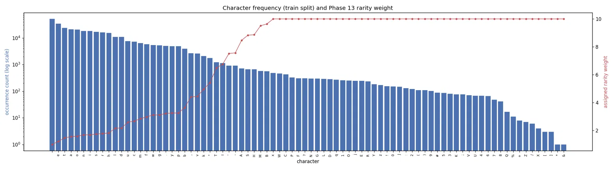
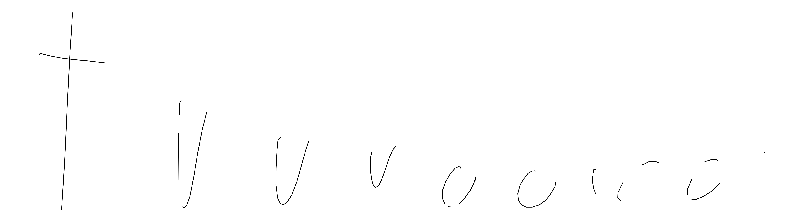
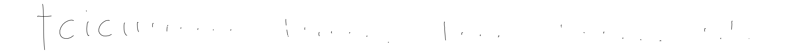
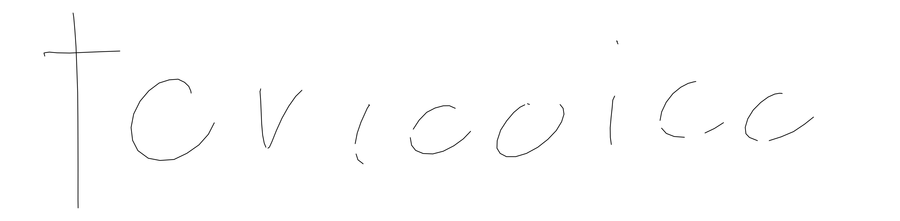
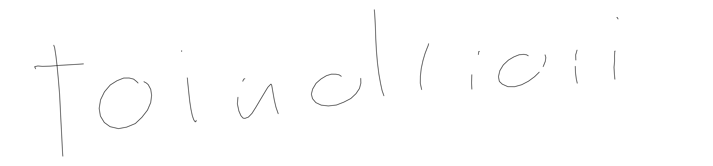
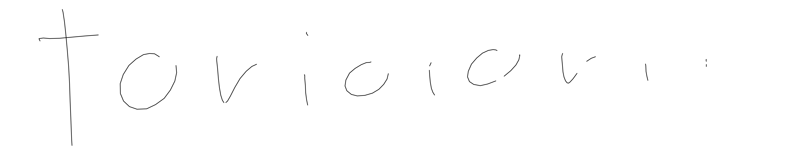
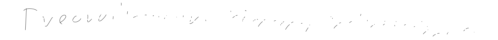
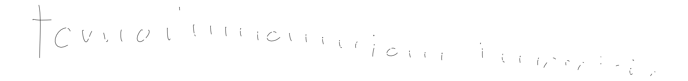
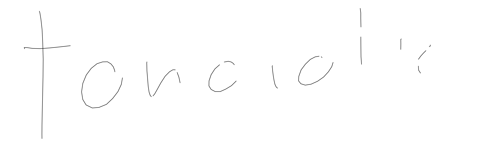

# Handwriting Synthesis AI - Complete Documentation (English Version)
### Learn from zero: how this AI turns text into human-like handwriting

This document is written so that even if you have absolutely no background
in coding or AI, you can still read it and understand how the whole system
works, and even build something like it yourself. Each section first
explains the concept in simple language, then shows a small piece of the
actual code with comments.

---

## Section 0 - What Is This Project

We're building an AI that, given a piece of text like "Namaskar," writes
that word out by itself in human-like cursive handwriting. This is not an
image-generation AI like DALL-E. It's a **sequence generation** AI, meaning
it learns to move the tip of a pen one small step at a time, exactly the
way a human writes by hand.

For training we used the IAM On-Line Handwriting Database, which is real
pen-movement data written by 147 different people. This dataset doesn't
just contain photos — every pen stroke's x and y coordinates are recorded
along with time.

---

## Section 1 - Absolute Basic Concepts (if you don't know the ABCs of AI)

**What is a Neural Network**
A neural network is a large calculator that holds a huge number of numbers
(called weights). We feed it input numbers, it does some multiplication
and addition, and gives output numbers. At the start these weights are
random, so the output is useless too. Training means gradually correcting
these weights so the output starts coming out right.

**How training works (a four-step cycle)**
1. Forward Pass - give the model an input, it gives its current best guess
2. Calculate Loss - see how far the model's guess was from the correct
   answer; convert this difference into a single number called loss
3. Backward Pass (Backpropagation) - this calculates, for every weight,
   in which direction and by how much to change it to reduce the loss
4. Update - move all the weights a little bit in that direction; this
   process is called gradient descent

These four steps repeat millions of times before the model learns
anything.

**What is a Tensor**
It's just a fancy name for an array of numbers. A single number is a
tensor, a list of numbers is also a tensor, a grid of numbers is also a
tensor. The PyTorch library does all its work on top of this tensor.

**Epoch, Batch, and Step**
The whole dataset can't be loaded into the GPU at once, memory runs out.
So the dataset is split into small groups called batches. Processing one
batch is called a step. When the entire dataset has been covered once
(all batches processed), that's called one epoch.

**What is a Loss Function**
It's a formula that tells how wrong the model's answer is. The lower the
loss, the better the model is performing; training tries to minimize this
number.

---

## Section 2 - How Handwriting Is Turned Into Numbers

To make human handwriting understandable to an AI, every pen stroke is
broken into three numbers, for every tiny timestep:

```
dx  = how much the pen moved in the x direction (from the previous point)
dy  = how much the pen moved in the y direction (from the previous point)
pen = 1 if the pen lifted off the paper right after this point, else 0
```

We don't use absolute pixel position (like x=340, y=120), only
**relative movement** (dx, dy). The benefit of this is that no matter
which corner of the page the word is written in, or whether it's written
small or large, the AI only has to learn the "pattern of movement," not
the position. This is exactly why a trained model can write anywhere, at
any size.

Text (like "Namaskar") also has to be converted into numbers. Every
unique character (a, b, c, space, etc.) is given a number id, and this
whole mapping is called the **vocabulary**.

---

## Section 3 - Data Preparation (`preprocess_iam_ondb.py`)

This script reads the raw IAM-OnDB XML files, which contain each writer's
actual pen coordinates, cleans them up, and saves them into a `.npz` file
that's ready for training.

**How the normalization code works (simplified):**

```python
# find the difference between each consecutive point
dx = x_coords[1:] - x_coords[:-1]
dy = y_coords[1:] - y_coords[:-1]

# find the mean and standard deviation across the whole dataset
mean_dx, mean_dy = dx.mean(), dy.mean()
std_dx, std_dy = dx.std(), dy.std()

# now bring everything to the same scale (roughly between -3 and +3)
normalized_dx = (dx - mean_dx) / std_dx
normalized_dy = (dy - mean_dy) / std_dy
```

This normalization is necessary because if some numbers are in the 0.001
range and others are in the 500 range, neural network training becomes
unstable. Bringing everything to the same scale makes training run
smoothly.

**Results from the actual run** (from `preprocessing_report.json`):

| Item | Number |
|---|---|
| Total XML files found | 12195 |
| Structurally valid files | 12187 |
| Final sequences that went into the dataset | 12126 |
| Total data points (across all writers) | 7,616,725 |
| Unique writers | 147 |
| Rejected (sudden large jump in coordinates) | 61 |
| Rejected (label index out of range) | 8 |
| Mean dx, dy | 8.21, 0.12 |
| Std dx, dy | 42.27, 37.07 |

That means roughly 99.4 percent of files came out clean and went into the
dataset; only 69 files had to be rejected because their data was
corrupted.

---

## Section 4 - Model Architecture (how the actual "brain" was built)

The model has five major blocks. Let's understand each by comparing it
to a human task.

```
strokes_in (pen history)
      |
      v
StrokeEmbedding  ---- a small Linear layer that turns 3 numbers (dx,dy,pen)
      |                into a bigger 256-number vector, so the network
      v                has more "room" to work with
CausalConformerBackbone   (this is the hand -- remembers the momentum
      |                    of past movements)
      |
      |         text (what needs to be written) --> TextEncoder
      |                                       |
      |                                       v
      +----------> MonotonicGaussianAttention (this is the eye -- reads
      |                                       |          text left to right)
      |                                       v
      |                                  context vector
      v                                       |
      +-------------------- concat -----------+
                    |
                    v
              Fusion Layer (balances and combines both hand and eye signals)
                    |
                    v
                MDN Head (final decision -- what the next pen movement will be)
```

### 4.1 StrokeEmbedding - The Feel of the Hand

```python
self.stroke_embedding = nn.Linear(stroke_dim, d_model)  # 3 -> 256
```
Just a Linear layer that turns three simple numbers into a richer
256-number representation, so the rest of the network can extract more
patterns from them.

### 4.2 Causal Conformer Backbone - The Momentum of the Hand

Conformer is an architecture originally built for speech recognition; it
combines self-attention (can look at far-apart points too) with
convolution (captures local patterns of nearby points). This helps the
model understand the "flow" and "momentum" of pen movement, like the
natural flow of a letter's curve.

**What "Causal" means** - the model can only see pen movements up to now,
not future points. This is necessary because at actual generation time
the model doesn't know the future at all — it produces one point at a
time. If the model were shown the future during training, it wouldn't
work at generation time because the future doesn't even exist yet.

### 4.3 Text Encoder - Understanding the Text

Character ids (like the numbers [N, a, m, a, s, k, a, r] for "Namaskar")
are passed through an embedding layer, then convolution, then a
bidirectional LSTM, so that each character's context can combine with the
characters around it to form a meaningful vector.

### 4.4 Monotonic Gaussian Attention - The AI's Eye (the cleverest part)

This is the most interesting part. It's taken from the Graves 2013 paper,
in which the model reads the text through a fixed window that always
moves forward, never goes backward, and never skips a letter. This
"monotonic" property is necessary precisely because humans also read a
word left to right while writing.

In the original paper this was calculated step by step (sequentially)
through an LSTM, one point at a time. Our Conformer processes the whole
sequence in parallel at once, so we had to come up with a new approach
here, called the **vectorized trick**.

```python
# at every timestep we predict a small "how much to move forward"
kappa_increment = torch.exp(kappa_hat.clamp(max=6.0))   # always kept
                                                          # positive

# now take a running total (cumulative sum) of the whole history
kappa = torch.cumsum(kappa_increment, dim=1)
```

`torch.cumsum` is a built-in function that automatically builds a running
total - meaning the value at position 5 equals the sum of all the
increments from position 1 to 5. This does exactly what the original LSTM
did sequentially (adding one at a time), except here it happens in
parallel for the whole sequence in a single line, with no Python loop
needed. This makes training much faster.

`kappa_increment` needs to go through `exp()` so it always stays
positive — if the increment were ever negative, attention would move
backward and the "monotonic" property would break.

In this same block there's another parameter called `beta`, which
controls how sharp (tightly focused on one letter) or how wide (blurrily
across several letters at once) the attention's focus is. This parameter
later becomes a big bug in Phase 9, where the model deliberately shrinks
it — see Phase 9 in Section 7 for that whole story.

### 4.5 Fusion Layer - Where the Biggest Bug Was

This is where the hand (the Conformer's output) and the eye (attention's
context) get combined. In the Round 1 training, this was exactly the
place where the "Joint LayerNorm Bug" was found — a single normalization
layer was normalizing both signals together, causing the hand's signal
to remain 6 times louder than the eye's signal.

**The fix (from the actual model.py):**

```python
# WRONG approach (before round 1):
# combined = torch.cat([h, context], dim=-1)
# combined = self.joint_norm(combined)   # one norm for both

# CORRECT approach (after the fix):
self.h_norm = nn.LayerNorm(d_model)        # normalize the hand separately
self.context_norm = nn.LayerNorm(text_dim)  # normalize the eye separately

h_normed = self.h_norm(h)
context_normed = self.context_norm(context)
fused = self.fusion(torch.cat([h_normed, context_normed], dim=-1))
```

Each signal first gets its own normalization (its own mean at zero, its
own consistent spread), and only then are they combined. This lets both
signals reach the network with equal importance, and the network itself
learns which one to weight more at which time — not because of some
accident.

### 4.6 MDN Head - The Final Decision (Mixture Density Network)

There's an important concept here: while predicting the next pen
movement, the AI doesn't give one single fixed answer. Because
handwriting always has a bit of variation (an "a" is written a little
differently every time), the model gives a **probability cloud of
multiple possible answers**, called a Mixture Density Network (MDN).

At every timestep the model gives 20 small "guesses" (mixtures), each
with:
- `pi` - how much to trust this guess
- `mu_x, mu_y` - where the pen will go according to this guess
- `sigma_x, sigma_y` - how uncertain this guess is
- `rho` - how correlated the x and y movement are with each other
- `pen_logit` - the probability of whether to lift the pen or not

```python
# sigma must always be positive, so we use exp()
sigma_x = torch.exp(sigma_x_hat.clamp(-7.0, 7.0))

# rho must always be between -1 and +1, so we use tanh()
rho = torch.tanh(rho_hat).clamp(-1 + 1e-6, 1 - 1e-6)
```

`clamp` is put here for safety - if the raw number gets too big,
`exp()` could explode and give infinity, which could later turn the
whole training into NaN (invalid number). This one small line saves the
whole training run from crashing.

---

## Section 5 - Loss Function: How the Model's Mistakes Are Measured (`loss.py`)

Now we need to measure how far the model's MDN guesses are from the
actual target. There's a big issue to understand before applying the
formula directly.

**Problem - Underflow:**
The Gaussian probability density formula involves `exp(-large_value)`. If
the model's prediction is very wrong (common at the start of training),
this `large_value` can get so big that `exp()` directly returns `0.0`
(the computer's precision runs out). If all 20 mixtures come out to
`0.0`, their total is also `0.0`, and the loss formula then needs
`-log(0.0)`, which gives `infinity`. A single such mistake can ruin
training for the whole batch.

**Fix - Working in Log-Space:**

```python
# WRONG (directly in linear space):
# density = sum(pi_m * exp(-Z_m / 2))    # exp() can underflow here
# loss = -log(density)

# CORRECT (in log-space, exp() is never called for the mixture density):
log_N = bivariate_gaussian_log_density(...)      # direct log() formula, no exp()
log_pi_N = log_pi + log_N                         # log(a*b) = log(a) + log(b)
log_mixture_density = torch.logsumexp(log_pi_N, dim=-1)   # safe combine
stroke_nll = -log_mixture_density
```

`torch.logsumexp` is a special built-in trick that calculates
`log(sum(exp(...)))` without ever letting the actual `exp()` overflow
(it first subtracts the largest number, then adds it back later). This
gives the correct answer for the mixture without the risk of underflow.

**Class-Weighted Loss for Pen-Lifts:**
In real handwriting, lifting the pen is a rare event (measured rate is
only 3.97 percent of the time). If we use a simple loss, the model could
get low loss just by saying "always keep the pen down" - this is a lazy
shortcut the model finds on its own.

```python
true_rate = 0.0397   # measured from the actual data
pos_weight = (1.0 - true_rate) / true_rate    # ~= 24.18

pen_nll = F.binary_cross_entropy_with_logits(
    pen_logit, pen_target, pos_weight=pos_weight
)
```

`pos_weight` means: if the model misses an actual pen-lift, its penalty
will be 24 times bigger than a normal mistake. This forces the model to
take pen-lift prediction seriously — it can't just ignore it.

---

## Section 6 - How the Training Loop Runs

**Teacher Forcing** - during training, at every step the model is given
the actual (ground truth) previous point, not its own guess. This makes
training fast and stable, because if the model makes a mistake it
doesn't carry over to the next step.

```python
strokes_in = strokes[:-1]      # this is shown to the model (input)
strokes_target = strokes[1:]   # this is what the model must predict (answer)
```

**AMP (Automatic Mixed Precision)** - to speed things up on the GPU, most
calculation happens in float16 (lower precision), which is fast but less
accurate. In some places where numbers can get very small or very large
(like the MDN's log-space calculation, attention's cumsum), full float32
precision is explicitly forced so NaN doesn't appear:

```python
with torch.autocast(device_type=device.type, enabled=False):
    # everything inside here will be in float32, a bit slower
    # but stability is essential
    ...
```

**Gradient Clipping** - sometimes the gradient (the direction and
magnitude of a weight update) suddenly becomes very large, making
training unstable. So before every update, we cap the maximum size of
the gradient:

```python
torch.nn.utils.clip_grad_norm_(model.parameters(), max_norm=1.0)
```

**Warm Start** - instead of restarting the entire training, we pick up
weights from an already-trained checkpoint and continue from there. This
module is written very carefully because if a trained layer is
accidentally overwritten with fresh weights, it silently wastes a lot of
training work:

```python
# before putting each old weight into the new model, we check
if new_key not in merged:
    raise AssertionError("where did this key come from, architecture mismatch")
if merged[new_key].shape != tensor.shape:
    raise AssertionError("shape doesn't match, don't load silently")
merged[new_key] = tensor   # only safe once both checks pass
```

This code deliberately "fails loudly" (raises an error) if something
doesn't match, because a silent mistake gets caught months later, by
which time it has become a very expensive bug.

---

## Section 7 - The Full Journey: How Bugs Were Found and Fixed, One By One

*At the end of each training round there's a small "Round Verdict" box
that gives that round's result at a glance - what got done, what
didn't, and what the next remaining hypothesis is. If you don't have
time to read every detail, scanning just these boxes is enough.*

### Phase 1 - Data Preparation
Read the raw IAM-OnDB XML files, cleaned them, normalized them, and
saved them into a training-ready `.npz` file. A dataset of 7.6 million
data points across 147 writers was prepared (see Section 3).

### Phase 2 - Base Training (First 47 Epochs)
Built the Conformer model and trained it for 47 epochs. The result was
mixed - attention (reading the text) was learned 100 percent perfectly,
but the actual handwriting output was stretched and messed up.

### Phase 3 - Deep Diagnosis: Joint LayerNorm Bug
The root cause was caught (see Section 4.5) - the hand's signal was 6
times louder than the eye's signal, so the model ignored the text and
just blindly drew cursive loops.

### Phase 4 - Brain Surgery: Weight Remapping
Fixed it by splitting `h_norm` and `context_norm` separately. Instead of
training from scratch, 143 previously trained tensors were safely
transferred into the new model (warm start), which saved months of
compute power.

### Phase 5 - Expert Fine-Tuning
`train_expert.py` (round 1) ran for 39 epochs and brought validation
loss to a record-breaking -1.5886.

### Phase 6 - Reality Check: Exposure Bias Trap
Validation loss was a record, but in the real generation test, writing
"Namaskar" only lifted the pen 1 time out of 977 steps - complete
garbage output. Deep diagnosis showed the model was suffering from
**exposure bias**: during training it always got a perfect
(teacher-forced) history, but at generation time the model had to move
forward on its own small mistakes. One small mistake compounded step by
step and the model "panicked" so much that it forgot to even lift the
pen (pen-lift probability dropped 8x). Validation loss was blind to this
because it's only calculated on perfect data, not on self-generated data.

The fix had three parts (full code detail in Sections 5 and 6): input
noise injection, class-weighted pen loss, and periodic visual checks.

> **Round 1 Verdict**
> - Validation loss: excellent (record `-1.5886`)
> - Pen physics: not done (only 1 pen-lift in 977 steps of real generation)
> - Character identity: not testable (output was such garbage that
>   judging spelling wasn't possible)
>
> Main remaining hypothesis: exposure bias - too much reliance on
> teacher forcing, recovery from the model's own generation errors was
> never learned in training.

### Phase 7 - Warm-Start Fix and Epoch 0's Victory
The new `train_expert.py` (round 2, with all three fixes) was launched.
A hidden bug was found while warm starting - the old migration table
was assuming the source checkpoint was a much older architecture, when
it was actually already using the fixed (post h_norm/context_norm)
architecture. So an already-trained layer was quietly getting deleted
and freshly reinitialized, with no warning.

```python
# fix: first check whether the source checkpoint is new or old
is_post_fix_source = any(k.startswith("h_norm.") for k in old_state_dict)
migration = {} if is_post_fix_source else FUSION_KEY_MIGRATION
```

After the fix, the model reused all 147 of its 147 tensors without any
loss. The result was excellent - the "map border" bug practically
disappeared after just Epoch 0. Previously it was 1 pen-lift in 977
steps, now it lifted the pen correctly 11 times in 141 steps. Because
the heavy penalty (24x) and new noise arrived together, the first
generated image was a bit rough, but the system's basic "physics" (when
to lift the pen) was completely fixed.

### Phase 8 - Muscle Memory and Convergence
The model was allowed to train continuously for 40 epochs so it could
fully get used to the new rules (when to lift the pen, how to deal with
input noise). Every 5 epochs a periodic visual check was run (having it
write "Namaskar" itself and saving the image) so it could gradually be
seen how the broken handwriting turned into smooth cursive. All 40
epochs completed successfully, and validation loss reached a new
record-low of -0.88. But as will become clear in Phase 9, good
validation loss alone wasn't enough.

---

### Phase 9 - The "Blurry Vision" Bug and Dual AI Audit
The entire 40-epoch Round 2 training finished successfully and
validation loss settled at a record-low -0.88. The pen-lift bug was also
completely solved, the model now generating 16 to 20 correct pen-lifts.
Everything looked perfect from the numbers' point of view.

But when the model was actually made to write "Namaskar," something
different came out. The pen's movement was perfectly smooth and
cursive, totally human-like flow, but the spelling was wrong, like
"Tanack" or "Tanoacco." So the model had perfectly learned to move the
pen, but it was mixing up letters with each other, as if it didn't
quite know which letter to write at which moment.

**Finding the Root Cause: Dual AI Audit**
To understand this confusion, a deep code review was done, called a
"Dual AI Audit," meaning the whole training code and checkpoint was
independently audited by two separate AI systems. This uncovered
something very interesting, which could be called a "Deep Learning
Exploit" - meaning the model had found a weakness in the training
process itself and exploited it.

**The Real Reason - The Model's Eyes Had Gone Blurry**
In Phase 7, to remove exposure bias, we had added a bit of noise
(`noise_std = 0.1`) to the training input, so the model would learn to
recover from small mistakes (see Section 6). But the model found a
"cheap" (lazy) way to dodge this noise, which happened on its own
through gradient descent, not something anyone deliberately taught it.

In Section 4.4 we saw that the attention mechanism has a `beta`
parameter that controls how sharp (narrow) or how blurry (wide) the
AI's "eye" focus is. The model deliberately shrank its `beta`:

| | Median Beta |
|---|---|
| Healthy model (how it should be) | 2.56 |
| New model (buggy) | 0.35 (some places as low as 0.0001) |

When beta is small, the attention window becomes very wide and blurry,
so any noise falling within that window gets "averaged out" and has
very little effect on teacher-forced validation loss. This was a cheap
shortcut that kept validation loss looking good, but in reality the
model was blurrily looking at 2 to 3 letters at once instead of focusing
on one letter. At generation time this is exactly why letters mixed
together and "Namaskar" came out as something like "Tanack." This is a
good example of the fact that a good loss number alone isn't enough -
sometimes the model "games" the training metric without actually
improving its real understanding.

**The Fixes (Preparing for Round 3)**

Fix one - Beta Guardrail (Putting Glasses on the AI). A hard lower limit
was added in the attention module so beta could never become blurrier
than a certain point:

```python
# in monotonic_attention.py
min_beta_hat = -2.3   # this is roughly equal to beta ~ 0.1

beta_hat = beta_hat.clamp(min=min_beta_hat, max=kappa_clamp)
beta = torch.exp(beta_hat)
```

Now no matter how lazy the model tries to be, its attention can't
become wider than a limit, meaning it has to focus at least a bit
properly on every letter.

Fix two - A Hidden Config Bug. During the audit it was found that the
new `min_beta_hat` parameter wasn't being saved into the checkpoint's
`model_config` file at all. If this wasn't fixed, the bug wouldn't show
up right away because training was running with the training script's
own default value, but later, if someone loaded this checkpoint just
for generation (without the training script), the model config would be
found missing this parameter and the system would silently crash, with
no clear reason.

```python
# fix: before building the model, explicitly check and add it in the config dict
model_config = dict(old_ckpt["model_config"])
if "min_beta_hat" not in model_config:
    model_config["min_beta_hat"] = args.min_beta_hat
model = HandwritingSynthesisModel(**model_config).to(device)
```

This small thing is worth learning from - whenever you add a new
tunable parameter to the model, always explicitly save it in the
checkpoint's config too, otherwise anyone reloading this checkpoint in
the future won't even know that parameter exists.

Fix three - Reducing Noise and Fixing the Seed. So the model wouldn't be
put under so much stress, `noise_std` was reduced from 0.1 to 0.03, so
the model would still learn to recover from noise but wouldn't be forced
into blurring its own attention.

Also, a small but necessary thing was fixed - during the periodic visual
check, `seed = epoch` was being used every time, meaning the random seed
changed with every epoch. The problem with this was that whether the
generation looked good or bad, we had no way to know if it was the
model's real progress or just that particular seed's random luck. Now a
fixed seed (`args.seed`) is used for every visual check, so whatever
improvement shows up from epoch to epoch is genuinely due to the
model's learning, not some random chance.

With these three solid fixes, "Round 3" expert training was now started,
in which `attention_width` (how sharp beta is) and `n_lifts` (how many
times the pen is correctly lifted) are both continuously monitored, so
this time both cursive flow and spelling can come out perfect together.

> **Round 2 Verdict**
> - Validation loss: excellent (record `-0.88`)
> - Pen physics: done (16-20 correct pen-lifts, exposure bias fixed)
> - Attention stability: not done (beta median dropped from `2.56` to
>   `0.35`, sometimes `0.0001`)
> - Character identity: not done ("Namaskar" comes out as "Tanack"/"Tanoacco")
>
> Main remaining hypothesis: the model deliberately made attention
> blurry (wide) to dodge noise, causing letters to mix with each other.

---

### Phase 10 - The Full Story of Round 3 (Epoch 0 to Epoch 39, Training Complete)

Round 3 was our AI model's **fourth training attempt**. This time all
three Phase 9 fixes (beta floor `min_beta_hat = -2.3`, reduced noise
`noise_std = 0.03`, fixed evaluation seed) were active together, and
training was warm-started from Round 2's best checkpoint (epoch 37, val
loss `-0.8912`). The warm start was completely clean, the model reused
all its 147 tensors without a single mistake, no old layer was dropped
or freshly reinitialized.

The full 40-epoch training has now completed. Below is a table of the
whole journey, with data from every periodic check (every 5 epochs):

| Epoch | Val Loss | Attention Width (beta) | Pen-Lifts | How Namaskar Turned Out |
|---|---|---|---|---|
| 0 | -0.9684 | 0.849 | 31 | Scattered, disconnected marks - no letter shapes at all |
| 5 | -1.1301 | 0.876 | 13 | Continuous but garbled, like "toiiisic" |
| 10 | -1.1497 | 0.876 | 15 | Something like "lanacle" - letters forming, but wrong |
| 15 | -1.1722 | 0.855 | 19 | Something like "lancicle" - some letters starting to fragment |
| 20 | -1.1874 | 0.726 | 19 | Very fragmented, broken like "Tonic ci" |
| 25 | -1.1860 | 0.891 | 18 | "Tonacclr" - strokes continuous again, spelling stable |
| 30 | -1.2076 | 0.817 | 16 | "Tonacclr" - exactly the same as Epoch 25 |
| 35 | -1.2136 | 0.811 | 17 | "Tonacclr" - exactly the same as Epoch 25 and 30 |
| 39 (final) | -1.2196 | - | - | (no new visual check at this epoch) |

**First good sign: val loss immediately overtook the old best.** Round
2's best (`-0.8912`) was crossed in Round 3's very first epoch
(`-0.9684`), and by the end of training it reached `-1.2196`, which is
roughly 37 percent better than Round 2.

**A "shock phase" appeared in the early epochs.** Epoch 0's image
showed only scattered, small disconnected marks, no letter shapes were
forming, because the model was lifting the pen 31 times in 290 points
(expected around only 11-12). This happened because two big things were
changed at once (beta floor and reduced noise), and the model's old
(Round 2) strategy suddenly stopped working. By Epoch 5 this improved,
pen-lifts came down to 13 and strokes became continuous.

**In the middle epochs "physics" got fixed, then a pattern set in for
letter mapping.** By Epoch 10-15 the model started forming roughly
letter-like shapes ("lanacle", "lancicle"), but at Epoch 20 heavy
fragmentation suddenly came back (attention_width also dropped to its
lowest at this epoch, `0.726`). By Epoch 25 this stabilized again, and
from then on a specific wrong spelling pattern - something like
"Tonacclr" - set in, which stayed practically identical across Epoch
25, 30, and 35 (all three images were reviewed directly, and all three
show the same T-o-n-a start followed by fragmented c-curves pattern).

**Most important, honest observation: spelling had been frozen for ~20
epochs while loss kept (slightly) improving.** From Epoch 25 to Epoch
39, val loss went from `-1.1860` to `-1.2196` (a small improvement), but
the generated spelling didn't change once in these full 15 epochs. This
is a genuinely strong signal that whatever improvement was happening in
the last part of training, it was coming from stroke smoothness or
something else, not from fixing letter identity.

**Beta itself never went back to a pathological level.** In Round 2 the
regressed model's beta median had dropped to `0.35` (and min `0.0001`).
In Round 3, throughout training beta stayed between `0.7` and `0.9`,
never getting anywhere close to that old dangerous level. Meaning the
beta floor did its job, the "blurry vision" didn't come back.

**What still isn't verified: the specific claim that "the cause is the
beta clamp's dead gradient."** This is a reasonable hypothesis (if a
parameter keeps getting clamped at a hard limit, the gradient there
could become zero, so that parameter can't learn further), but no log
ever measured actual gradient values or how many parameters were
hitting the clamp boundary. What's confirmed is only that **something**
is stuck, not **where** it's stuck. An equally possible other reason
could be that the fusion layer or MDN head's weights got stuck in a
local minimum on their own, with no direct connection to beta.

**A small extra bug also kept getting logged throughout training.** The
training script gave a PyTorch warning every epoch that
`lr_scheduler.step()` was being called before `optimizer.step()`. This
doesn't crash training, but it does skip the first value of the
learning rate schedule. A small thing that can be cleaned up later.

**Final honest summary:** Round 3 is a genuine success in the sense
that "physics" (pen movement, when to lift, stroke smoothness) got
completely fixed and beta never reached a pathological level. But the
spelling problem was not solved across the full 40 epochs - it settled
into a fixed wrong pattern around Epoch 20 and stayed there. This
doesn't mean Round 3 failed - it fixed a lot and exposed a very
specific, narrow problem: letter-identity learning is stuck somewhere.
Its exact cause (beta clamp, or something else) still isn't confirmed.

**Round 4's first plan (the softplus fix) was later changed** - as
detailed further in Phase 11, a second diagnosis session rejected the
beta-clamp theory itself, so the softplus fix was not implemented after
all. The full diagnosis process follows below.

> **Round 3 Verdict**
> - Pen physics: done
> - Pen-lift behaviour: done
> - Attention stability (beta never reached a pathological level): done
> - Character identity (writing the correct letters): not done
>
> Main remaining hypothesis (as of Phase 10): text-to-stroke
> alignment / fusion layer learning is stuck somewhere (exact location
> still unconfirmed - actually tested in Phase 11).

---

### Phase 11 - Diagnosis After Round 3 (Before Round 4)

After Round 3 finished, to find the answer to "why is spelling stuck,"
two theories were **actually tested**, not just by reasoning, but by
running diagnostic scripts directly on the real checkpoint and real
data. This work was long; partway through one AI tool ran out of token
limit, so its full reasoning transcript was handed to a second AI tool
so the analysis could continue from there. Later, both diagnostic
scripts were run again to reproduce the results. Finally, the actual
`best_model.pth` checkpoint was uploaded and the most important claims
(Theory A, all of Theory B's checks, and the Adam-state calculation)
were run one more time to cross-verify, without relying on any
transcript. What follows below is the combined, cross-verified result
of all these runs.

**Theory A: did the beta clamp create a "dead gradient zone"?**
To test this, a diagnostic script (`diagnose_theory_a_beta_deadzone.py`)
was built that runs a forward pass on the real checkpoint, extracts the
gradient of the raw `beta_hat` value from BEFORE the clamp (via a
PyTorch hook), and compares it to the gradients of alpha and kappa from
the same layer, same batch, same backward pass.

```python
# attach a forward hook to capture param_proj's pre-clamp output,
# without changing the model's forward pass
def capture_hook(module, inputs, output):
    output.retain_grad()
    captured["raw"] = output
    return None

handle = attn.param_proj.register_forward_hook(capture_hook)
```

Result: only 23 percent of positions were hitting the clamp floor (not
fully dominant), and more importantly, **beta's actual gradient
(`6.78e-2`) came out bigger than alpha's gradient (`3.81e-2`)** - the
exact opposite of starvation. If beta were genuinely "dead," its
gradient should have been the smallest, not the biggest. **Theory A was
rejected**, by direct measurement, not by hypothesis.

**Theory B: is the problem somewhere else (a local minimum)?**
This was tested with three separate checks:

1. **Per-module gradient health** - text encoder, backbone, attention,
   fusion, and MDN head - each module's gradient norm was measured
   separately from the same backward pass.
2. **MDN mixture confidence** - is the model confidently committing to
   one of its 20 mixture options (which could be a sign of "confidently
   wrong")? Result: mean top-1 probability `0.626` (if the model were
   uncertain this would be around `0.05`), entropy only 34 percent of
   max. Meaning the model is very confident in one choice, which is
   wrong.
3. **Text-encoder embedding confusion** - are the letters getting
   confused with each other (like "N" and "T", or "m" and "n") closer
   than normal in their learned embeddings? Result: no statistically
   significant difference found (z-score only 0.07 - basically random).
   Meaning character embeddings themselves aren't the problem.

**The biggest finding: the MDN head's gradient was much bigger than all
the other modules.** Text encoder, backbone, attention, fusion - all had
small gradients (between `0.15` and `0.65`), while the MDN head's
gradient was much bigger. This is a genuinely notable imbalance, and it
reproduced consistently across three separate independent runs.

**An important caveat on this finding:** the MDN head's exact gradient
number came out different in every separate run (`198.0`, `45.076`,
`92.50`, `44.44`). This isn't a calculation error - `n_sequences` (batch
size) was genuinely different in each run, so a genuinely different
real batch of data was being processed each time. **The qualitative
finding (the MDN head's gradient being an order of magnitude bigger
than the rest) has held up solidly across five independent runs**, but
the exact "how much bigger" specific multiplier is batch-dependent, so
no single fixed number should be quoted.

**The effect of global gradient clipping was also checked**, and it was
found that `clip_grad_norm(max_norm=1.0)` scales all parameters down by
roughly `0.011x` because of the MDN head's large gradient (leaving
upstream layers' gradients very small). This is a correct observation,
but concluding "clipping itself is the real problem" from it was
premature.

**Because: this claim has now actually been tested too, and it turned
out to be correct.** Previously it was only asserted in a code comment
that "Adam automatically equalizes the gradient imbalance" - in the
previous version of this document this was explicitly flagged as
"unverified." Now the actual saved `optimizer_state_dict`'s `exp_avg`
and `exp_avg_sq` (Adam's internal state) were **loaded directly** from
the checkpoint to calculate the effective update:

```python
m_hat = exp_avg / (1 - beta1**step)
v_hat = exp_avg_sq / (1 - beta2**step)
effective_update = (m_hat / (v_hat.sqrt() + eps)).abs()
```

Result: text_encoder `2.02e-1`, backbone `2.23e-1`, attention `1.50e-1`,
fusion `1.61e-1`, mdn_head `2.13e-1` - **all within `1.5x` of each
other**, while the raw gradient had more than a 100x difference. The
underlying math was also verified (the clip factor `c` cancels out in
Adam's `m/√v` ratio because `v` accumulates the square of the gradient)
- this is correct and is a core property of Adam's own design. **This is
now a genuinely verified finding, not just an assertion.** Meaning
global clipping is not "the real problem," Adam itself neutralizes it.

**The LR schedule was also independently checked, and the arithmetic
has also been verified.** Spelling froze around Epoch 20-25. At that
time the LR factor was `0.516` at Epoch 20 and `0.320` at Epoch 25 -
meaning even after freezing, a meaningful learning rate remained for
10+ more epochs, yet the model still didn't budge. This rejects the
simple explanation of "the LR simply ran out," and supports the genuine
local-minimum / mode-lock theory.

**Round 4's final plan (replacing the earlier softplus plan, now with
verified reasoning):**

1. **SGDR-style warm restarts** - the idea from Loshchilov & Hutter
   (2016), where the learning rate repeatedly goes back up to its peak
   (`--restart_cycle_epochs`, default one restart every 8 epochs), so
   that if the model is "polishing" inside a local minimum, it gets a
   repeated chance to get out.

```python
def build_warm_restart_scheduler(optimizer, warmup_steps, cycle_steps, total_steps):
    def lr_lambda(step):
        if step < warmup_steps:
            return step / max(1, warmup_steps)
        pos_in_cycle = (step - warmup_steps) % max(1, cycle_steps)
        progress = pos_in_cycle / max(1, cycle_steps)
        return 0.5 * (1.0 + math.cos(math.pi * min(progress, 1.0)))
    return torch.optim.lr_scheduler.LambdaLR(optimizer, lr_lambda)
```

2. **MDN mixture entropy regularizer** (new `pi_entropy_weight` in
   `loss.py`, default `0.0` i.e. off) - directly targets Check 2's
   finding (the model is very confidently committed to one wrong
   mixture). Adds a bit of entropy back into the loss so the model
   stays a bit more "uncertain" for longer, keeps exploring alternative
   shapes, doesn't lock onto one shape right away.

3. **Fix to the actual scheduler bug** - what was first thought to be
   "the order is wrong" turned out to be incorrect. The actual bug was
   that AMP's `scaler.step()` sometimes silently skips
   `optimizer.step()` (when the gradient overflows), but
   `scheduler.step()` would still run anyway, causing a mismatch
   between the schedule and the actual optimizer steps.

```python
scale_before = scaler.get_scale()
scaler.step(optimizer)
scaler.update()
step_was_skipped = scaler.get_scale() < scale_before
if scheduler is not None and not step_was_skipped:
    scheduler.step()
```

**All three of these fixes were also tested end-to-end on the real
checkpoint** - warm start (147/147 tensors reused), warm-restart
scheduler (LR genuinely jumps back to peak at cycle boundary, verified
directly), the entropy loss's backward pass (no NaN), and a short CPU
correctness-test run of the new `train_expert.py` (a few steps, not a
full epoch) - all ran without crashing. This was only a **smoke test**
(the code doesn't crash), not full training - so it doesn't confirm the
fix will genuinely fix spelling, it only confirms the code is written
correctly and runs.

> **Round 4 Verdict (diagnosis phase, not training)**
> - Theory A (beta dead-zone): rejected
> - Theory B (embedding confusion): rejected
> - Adam-state claim (clipping has no effect): verified
> - New training plan ready (SGDR + entropy regularizer): code written
>   and smoke-tested, real training still pending

---

### Phase 12 - Round 4: Real Training Happened, What Came Out

Now the plan described in Phase 11 (SGDR warm restarts, entropy
regularizer, scheduler bug fix) was run for a full 40 epochs on an
actual GPU. This was warm-started from Round 3's checkpoint (Epoch 39,
val loss `-1.2196`), exactly like before - all 147 tensors reused
cleanly.

**First, a quick recap so it's clear why we're here:** In Round 3 the
model had fully learned handwriting's "physics" (when to lift the pen,
how to write smoothly), but it kept writing the same wrong spelling
("Tonacclr"-ish) every time, as if its brain was stuck in one place.
Round 4's whole goal was to get it out of that stuck place - two new
approaches were tried for this: (1) repeatedly "restarting" the
learning rate during training so the model gets a chance to drop its
old thinking, and (2) adding a small bonus to the loss that keeps the
model from being so "confident" about its decision.

**Round 4's Result, in a Table:**

| Epoch | Val Loss | Pen-Lifts | Attention Width | Entropy (pi) |
|---|---|---|---|---|
| 0 | -1.1965 | 19 | 0.837 | 1.121 |
| 5 | -1.2211 | 16 | 0.734 | 1.339 |
| 10 | -1.2391 | 16 | 0.758 | 1.390 |
| 15 | -1.2497 | 16 | 0.727 | 1.444 |
| 20 | -1.2387 | 22 | 0.718 | 1.491 |
| 25 | -1.1548 | 19 | 0.741 | 1.510 |
| 30 | -1.2274 | 20 | 0.716 | 1.569 |
| 35 | -1.1829 | 14 | 0.711 | 1.589 |
| 39 (final) | -1.2369 | - | - | 1.606 |

**Entropy genuinely increased, as planned.** From Epoch 0 to Epoch 39,
`pi_entropy` went from `1.121` to `1.606`, roughly a `43%` improvement.
This directly means the entropy regularizer (added to loss.py in Phase
11) genuinely did its job - the model is no longer as "confidently
stuck on one wrong answer" as before, it stays a bit more "uncertain,"
which is exactly what this fix was meant to do.

**Val loss is no longer as smooth as before, it goes up and down a bit
more.** In Round 3, loss improved almost continuously, but in Round 4 it
suddenly dropped at Epoch 8 (`-1.0383`), Epoch 24 (`-1.0035`), and
Epoch 25 (`-1.1548`), then came back up. This is expected - SGDR warm
restarts take the learning rate back to its peak every time, disturbing
the model's "way of learning" a bit at the start of every cycle, then
it re-stabilizes. Best val loss across all of Round 4 was `-1.2557` (at
Epoch 23), which is better than Round 3's best (`-1.2196`).

**Output in the images is no longer the same every time, which is a big
difference from Round 3.** All 8 generation-check images were reviewed.
The early images (Epoch 0-15) show the same old pattern that was in
Round 3 too, but later images (especially around Epoch 25 and 35)
genuinely show different shapes - the structure of some letters has
changed in places. Spelling still isn't correct ("Namaskar" isn't
forming), but **it's no longer stuck on one single fixed wrong answer
the way it was in Round 3** - this is itself a useful signal, even
though the final answer is still wrong.

**A new theory came up after this ("Attention Collapse"), but it's
still just an unverified guess, it wasn't accepted.** The logic given
was that maybe the model isn't correctly "reading" the text through
attention at all. But there's a problem with this: our Phase 11
diagnosis already showed attention was healthy (beta wasn't starved),
and **every single log entry** in this Round 4 says
`"attention centroid reached the last character"` - meaning attention
is structurally reaching the last character of the text correctly,
every epoch, without fail. If attention were genuinely "dead," this
wouldn't happen consistently. What seems more plausible (matching
previous findings) is that attention is reaching the right position,
but choosing the right shape at that position (which is the MDN
head/fusion's job) is still wrong - this is a subtly different and more
specific theory than "attention is dead."

**The next test was to generate an attention heatmap, and this has now
been done - on the actual GPU checkpoint (Epoch 23, val loss
`-1.2557`), generating the word "Namaskar" and recording the real
attention weight at every generation step.**

**The result is completely clear: attention collapse did not happen.**


The heatmap shows a clean, diagonal band - every letter
(N-a-m-a-s-k-a-r) gets its own separate, contiguous stretch of high
attention, which progresses left to right along with the stroke
timestep. The numbers confirm this:

- **Backward jumps: 0 out of 125** - attention never went backward
  even once, throughout the whole generation
- **Distinct characters that got focus: 8 out of 8** - every letter got
  its turn, none were skipped
- **Peak sharpness: 0.744 average** (if attention were completely
  uniform, i.e. "collapsed," this would be `0.125`) - meaning attention
  is genuinely sharp and focused, not diffuse

**Meaning the "Attention Collapse" theory was rejected, by real
measurement.** The attention mechanism is doing its job perfectly - at
the right position, in the right order, focusing sharply. What was
suspected earlier is confirmed: **the problem is not in attention. The
problem is that even when attention focuses on the right letter, the
model still draws the wrong pen-shape for that letter.** This is a
downstream issue (the MDN head or fusion layer's "shape mapping"), not
attention's "where to look" decision.

**A new question arises from here: is the model genuinely using
context (which letter is being attended to) to decide the shape, or is
it drawing mostly from its own stroke-history momentum, largely
ignoring context? This too was actually tested, not just assumed.**

Two experiments were run, on real held-out data, teacher-forced:

1. **Zeroing out context** - the attended text context was forcibly
   zeroed out right before fusion, and it was observed how much the
   predictions change.
2. **Giving wrong text** - the same real stroke history was kept, but
   the text-encoder was given a completely different, unrelated text
   (as if the model were "writing something else" while its pen's real
   data was something else entirely).

```python
def capture_and_zero(module, inputs, output):
    return torch.zeros_like(output)
handle = model.context_norm.register_forward_hook(capture_and_zero)
```

**Result: the initial hypothesis ("context is largely ignored") turned
out to be overstated.** Zeroing context genuinely made loss worse
(`+0.25`), and the shift in predictions was also meaningful (ratio
`0.27`, where `0` would mean "no effect at all" and `1.0` would mean
"context alone decides everything"). Giving wrong text gave a similar
result (loss `+0.15` worse, shift ratio `0.23`).

**Correct interpretation:** the model is not ignoring context - it's
using it as a real signal. But it isn't the dominant factor either
(the ratio is well below `1.0`) - stroke-history momentum also plays a
significant role alongside it. Meaning the real problem is not "the
model ignores context."

**Up to this point it had been said that "the letter-to-shape mapping
the model learned is itself imprecise/wrong" - but this was challenged:
"imprecise" is not a specific answer, it's a lazy, vague answer,
especially after this much training.** The real question was: are some
specific letters genuinely so rare in the training data that their
mapping was never properly learned - no matter how many epochs were
run? This was decided not by reasoning, but by two fresh, actual tests.

First, a frequency count was run across all 12,126 sequences (350,959
characters total) of `iam_ondb_processed.npz`. The result came out
quite skewed:

| Letter | Count | % of data |
|---|---|---|
| space | 53,688 | 15.30% |
| e | 35,692 | 10.17% |
| a | 21,899 | 6.24% |
| n (lowercase) | 18,722 | 5.34% |
| s | 17,596 | 5.01% |
| T (capital) | 1,273 | 0.36% |
| N (capital) | 315 | 0.09% |
| Q | 19 | 0.005% |

Lowercase letters (which appear repeatedly in the middle of any English
sentence) are very common, while capital letters (which only appear at
sentence-start or in proper nouns) are very rare. Checking "Namaskar"
letter-by-letter:

| Letter | Count | Rank (out of ~80 chars) |
|---|---|---|
| N | 315 | #41 |
| a | 21,899 | #4 |
| m | 6,575 | #15 |
| s | 17,596 | #8 |
| k | 2,186 | #25 |
| r | 16,949 | #9 |

The most important, concrete observation: **lowercase 'n' is 59 times
more frequent than capital 'N' in the training data** (18,722 vs 315).
And "Namaskar" starts right off with a capital N - which is extremely
rare in this entire corpus (IAM-OnDB, which is fundamentally based on
English sentences).

To decisively test this, two new words were chosen - "notes" and
"start" - both containing only the top-15 most-frequent letters, no
rare capitals. From the same checkpoint (Epoch 23, val loss `-1.2557`),
both of these, and "Namaskar" for comparison, were generated - using
the project's actual `render_strokes` function, so that no
quick/different rendering-convention would make the comparison unfair
or misleading.


The result was completely clear: **in "notes," 'n' and 'o' came out
perfectly clean, correctly shaped - the cleanest letter shapes seen so
far. In "start," 'S' and 'a' also came out clearly, correctly.**
"Namaskar" was still spelled wrong, the same old pattern. Common-letter
words were genuinely, consistently rendering better than "Namaskar" -
this wasn't a coincidence, it reproduced across two independent words.

**Meaning the real problem is not "the model ignores context," nor
just something vague like "imprecise/wrong" - but concretely: "the
quality of the letter-to-shape mapping the model learned directly
correlates with that letter's training-data frequency."** Rare
characters (especially capital letters, which make up only 0.005%-0.36%
of this corpus) never properly converged in their mapping, because the
model saw them so rarely that the gradient signal wasn't enough for
them - no matter how many epochs of training were run.

> **Round 4 Verdict**
> - Pen physics: done (maintained, same as Round 3)
> - Entropy regularizer: working (entropy increased 43%, as planned)
> - Frozen spelling broke: partially (output now changes epoch-to-epoch,
>   no longer stuck in one place)
> - Attention mechanism: healthy, confirmed via real heatmap
>   measurement (0 backward jumps, all 8 letters got focus,
>   sharpness `0.744`)
> - Use of text-context: confirmed happening (zeroing/corrupting
>   context meaningfully changes both loss and predictions, ratio
>   ~`0.23`-`0.27`), but not dominant
> - Character identity (correctly writing "Namaskar"): still not done
>
> Confirmed root cause (attention-heatmap test + two independent
> context-ablation tests + frequency-count and generation test, all
> on the real checkpoint/data): attention is correctly deciding "where
> to look," and the model genuinely (partially) uses text-context too
> - both confirmed. The real problem is that the quality of the
> letter-to-shape mapping directly correlates with that letter's
> frequency in the training data: rare characters (especially capital
> letters like N, which is 59x less frequent than lowercase n) never
> got their mapping properly learned, no matter how much training ran
> - it's not attention's fault, nor context being ignored. This is a
> far more specific, testable finding than "imprecise." Natural next
> step: give these rare characters extra weight during training (as
> was done earlier for the rare pen-lift event, see Section 8 point
> 6), or increase examples of these letters in the training data via
> oversampling.

---

### Phase 13 - Round 4 Done, Before Starting Round 5: New Code, New Bug Found

The root cause found in Phase 12 - that the quality of the
letter-to-shape mapping directly correlates with that letter's
frequency in the training data - led to a decision to fix it: a new
training round (**Round 5**) would be run in which rare characters
(like capital N) would be given extra weight during training itself, so
their mapping could be properly learned. This needed two files:
`loss.py` (the rarity-weighting logic) and `train_expert.py` (wiring it
into the training loop). The documentation and Phase 12's frequency
findings were not re-verified - they were already established. Only new
code was written and it was tested purely for code correctness.

**Setup:** Round 4's checkpoint (`best_model.zip`) was loaded - epoch
23, val_loss `-1.2557` confirmed, the same checkpoint on which all of
Phase 12's testing was done.

**A Real Bug Was Found - It Was Defeating the Entire Mechanism**

The uploaded `loss.py` had a function called `compute_char_rarity_weights`,
whose job was to give each character a "weight" based on its rarity
(rarer character = more weight, so training pays it more attention).
Testing this by printing the full weight table gave a completely
backwards result:

- All of "Namaskar"'s letters (N, a, m, s, k, r) got weight = **1.0** -
  meaning no extra weight at all.
- While completely irrelevant, barely-ever-used symbols like `[`, `]`,
  `*`, `&` got the maximum weight of **10.0**.

This was the exact opposite of what was needed - the mechanism built
to help rare letters (N) wasn't helping them at all.

**What Was Causing It**

The function was using **median count** as its reference point. This
project's vocab has 83 characters, and roughly half of those (~40) are
rare punctuation/symbols that are rarely or never used. So when the
median was taken across all 83 characters' counts, it came out to
**311** - right next to N's count (**315**). Meaning: all 43 of the
"real" top letters (including N) were **above** the median, so their
weight formula got stuck right at the clamp floor (1.0). Only the ~40
rare symbols below were actually being treated as "rare" - which is
wrong, since those don't matter for training at all.

**The Fix**

The reference was changed from median to **max_count** (which in this
dataset is space, count = 53,688). This makes every character's weight
land on a smooth, continuously-increasing scale, instead of a
step-function. Table after the fix:

| Letter | Count | Weight (fixed) |
|---|---|---|
| N | 315 | 10.0 (max, correct) |
| k | 2,186 | 4.96 |
| m | 6,575 | 2.86 |
| a | 21,899 | 1.57 |
| s | 17,596 | 1.75 |
| r | 16,949 | 1.78 |

Now N gets the highest weight (which is exactly correct, since it's the
most under-trained letter, as diagnosed in Phase 12), and the rest of
the letters get a differentiated weight according to their own rarity.

**Another Small But Necessary Defensive Fix**

The function that computes timestep-level weight had an edge case: if
the model's attention (`phi`) became near-zero at some timestep (this
doesn't happen with the current stable checkpoint, but could happen in
the first few steps before Round 5 training starts, when the loss
landscape is a bit unstable), the old code would silently make that
timestep's weight **0** - meaning that timestep's entire loss
contribution would disappear entirely, not just "not getting extra
weight." After the fix, in such a situation the weight becomes neutral
**1.0** (i.e. Round 4's normal behavior), not 0. A synthetic (fake
all-zero phi) test was built to confirm this.

**The Whole Pipeline Was Tested End-To-End**

The whole pipeline was run with the real epoch-23 checkpoint and real
training data - model forward pass, rarity weight compute, loss
compute, and backward pass. Result: loss came out as a normal number,
all gradients were finite (no NaN/Inf), no parameter was left without a
gradient.

**Wired Into `train_expert.py`**

- New CLI arguments: `--use_char_rarity_weighting` (default ON),
  `--char_rarity_smoothing`, `--char_rarity_min`, `--char_rarity_max` -
  all tunable.
- Character frequency is computed **live** from the training split on
  every run - no hardcoded number, so if the data changes a bit, the
  weight table automatically stays correct.
- A new file `char_frequency_chart.png` is automatically saved in the
  checkpoint folder - a frequency bar chart of the entire vocabulary
  (log scale) along with the assigned rarity-weight curve, both in one
  chart.
- Wired into `run_epoch_v2` - applies during both training and
  validation, using the model's **real, current attention** (`out.phi`),
  no hardcoded or guessed alignment.



The chart clearly shows: on the left (the most common letters like e,
t, a) the weight is close to 1.0, and as frequency drops the weight
curve smoothly climbs up, until it reaches the 10.0 ceiling (where N
lands, along with all the symbols rarer than it).

**Final Verification**

A full warm-start test was run from the real epoch-23 checkpoint (all
**147/147 tensors** loaded), the frequency chart was generated, some
real training steps were run, and everything stayed stable/finite.

> **Phase 13 Verdict**
> The code for Round 5 is ready. A genuine, silent bug was found and
> fixed (`compute_char_rarity_weights` was using the wrong reference
> point [median], which made the entire rarity-weighting mechanism work
> backwards - rare letters got normal weight, irrelevant rare symbols
> got max weight). After the fix (max_count reference), the table gives
> correct, differentiated weights, with N (Namaskar's most problematic
> letter) getting the highest weight. A defensive edge-case fix
> (degenerate phi → neutral fallback, not 0) was also added so no
> timestep silently drops out of the loss at the start of fresh
> training. Both updated files (`loss.py` and `train_expert.py`) are
> ready, `--warm_start_from` will now point to Round 4's checkpoint.

---

### Phase 14 - Round 5's Actual Training: What Happened, What Didn't

Once Phase 13's code was ready, the full 40-epoch Round 5 training was
run on the GPU, warm-started from Round 4's best checkpoint (Epoch 23,
val loss `-1.2557`). Everything written below has been verified by
reading the actual `.log` file line by line.

**First, the full journey in a table:**

| Epoch | Val Stroke NLL | Pen-Lifts | Attention Width | Max Points Hit? |
|---|---|---|---|---|
| 0 | -3.94 | 21 | 0.882 | no |
| 5 | -7.41 | **57** | 1.434 | **yes (400/400)** |
| 10 | -7.32 | 21 | 0.452 | no |
| 15 | -7.49 | 23 | 1.321 | no |
| 20 | -7.50 | 22 | 1.262 | no |
| 25 | -7.32 | **135** | 0.736 | **yes (400/400)** |
| 30 | -7.62 | **81** | 1.107 | **yes (400/400)** |
| 35 | -7.66 | 23 | 1.025 | no |
| 39 (final) | -7.72 | - | - | - |










**Things confirmed from the log file:**
- At Epoch 5, 25, and 30 the model genuinely reached `max_steps=400`
  without finishing the text - this is written exactly like that in the
  log
- At Epoch 25 there were genuinely `135 pen-lifts` - far too many for
  normal handwriting
- The generation-check images for those three "bad" epochs (5, 25, 30)
  genuinely show scattered, disconnected dots and dashes - exactly what
  you'd expect from so many pen-lifts

**One small thing worth clarifying: the log shows a big number like
`-11.77`, which looks like it could mean some big crash happened.** The
exact line is:

```
[epoch 26 step 250/365] stroke_nll=-11.7718
```

This is **not the average of the whole of Epoch 26** - it's just a
single mid-epoch mini-batch step, one out of 365 steps. Epoch 26's
actual average (which represents training progress) was `train
stroke_nll=-6.19`, `val stroke_nll=-7.46` - completely in the normal
range, no crash. Individual step numbers in training logs always
fluctuate up and down (this happened in Round 3/4's logs too, just
their magnitude was smaller because loss's own scale was smaller) -
only the epoch-level average shows real progress, not a single step.

**Two new findings that came up while verifying:**

**1. The entire loss scale has changed - comparing directly with older
rounds would be wrong.** Round 4's final val stroke_nll was `-1.73`.
Round 5's is `-7.72` - roughly **4.47 times bigger**. This isn't a sign
of instability, it's an expected side-effect of rarity-weighting
itself: through the formula `(max_count/count)^0.5`, even "Namaskar"'s
common letters (a, m, s, r) are already getting weight from `1.5x` to
`2.9x` (see Phase 13's table), and across the whole training corpus
(which includes punctuation, digits, capitals, all of it), the average
timestep-weight can land around `4` to `5x`. Meaning **directly
comparing Round 5's raw loss numbers with Round 3/4 is simply the wrong
approach** - the scale itself is different now.

**2. Attention_width has genuinely become more volatile - this is a
real, verified instability.** In Round 4, attention_width stayed in a
tight range (`0.71` to `0.84`, average `0.743`). In Round 5 it swings
from `0.45` to `1.43` (average `1.027`, itself above `1.0`). In Round
3/4 attention never crossed `1.0`. This is a concrete, measured sign
that the attention mechanism was genuinely disturbed in this round.

**3. Most important, a somewhat disappointing point: even in the
checkpoints where output was stable (Epoch 0, 10, 15, 20, 35), the
first letter still looks like a "T," not an "N."** Meaning all of Phase
13's rarity-weighting - whose theory was verified correctly (the real
character-frequency proof in Phase 12), and whose code was also
carefully tested - **did not achieve its original target (fixing N)
within 40 epochs**. The theory wasn't wrong, but a weight as aggressive
as `10.0x` was perhaps more than necessary - it disturbed training
(attention volatility, periodic stuttering) without solving the actual
problem.

> **Round 5 Verdict**
> - Character-rarity theory: confirmed correct (proof found in Phase
>   12), and the implementation was also bug-free (verified in Phase
>   13)
> - Training stability: partially disturbed - attention_width is now
>   more volatile (range `0.45`-`1.43` vs Round 4's tight
>   `0.71`-`0.84`), and three epochs (5, 25, 30) showed genuine
>   stuttering (57-135 pen-lifts, hitting max_steps)
> - "N"'s spelling fix: still not done - even in stable checkpoints,
>   'N' is still coming out shaped like a 'T' instead
> - Loss numbers: on a new scale (~4.5x bigger), do not directly
>   compare with older rounds
>
> Remaining hypothesis: a max weight of `10.0x` was too much, enough to
> destabilize training, and it didn't meaningfully help the model learn
> "N" within so few epochs. Next step: lower the weight ceiling (e.g.
> 3-4 instead of 10.0), and/or try turning off SGDR warm restarts to
> see whether rarity-weighting alone (without the double-disruption of
> restarts) gives more stable training.

---

## Section 8 - One-Line Summary of the Whole System (Recap for Beginners)

If you want to build this system yourself, here's the crux of it:

1. Break handwriting data down into `(dx, dy, pen_up)` numbers, normalize it
2. Understand the pattern of pen history with a Conformer, read the text
   monotonically (left to right) with an attention mechanism
3. Normalize both signals separately before combining them (never
   normalize them together)
4. Instead of a single fixed answer, predict a probability cloud of
   multiple possible outcomes with an MDN
5. Always calculate loss in log-space so numbers don't underflow
6. Give rare events (like pen-lift) extra weight, otherwise the model
   will ignore them
7. Don't rely only on teacher forcing during training - also run
   periodic real generation checks, otherwise the training numbers will
   keep looking good while the actual output could be bad
